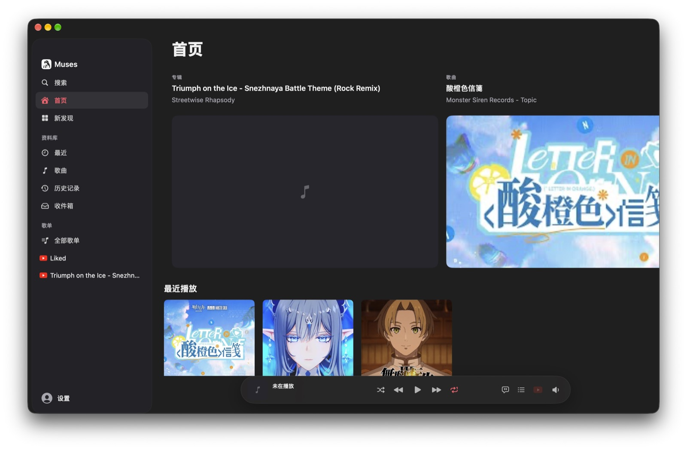

<p align="center"></p>
<h1 align="center">Muses</h1>
<p align="center">Your music. A quieter place to listen.</p>
<p align="center">Native macOS · YouTube music · Liquid Glass</p>
<p align="center"><a href="https://github.com/xiaotwu/Muses/releases/tag/v0.5.0">Download preview</a> · <a href="https://xiaotwu.github.io/Muses/">Website</a> · <a href="docs/installation.md">Installation</a></p>



Muses brings YouTube-backed music into a native Mac library, with a floating player, collection-aware queue, artwork-led Now Playing and lyrics. Built with Swift, SwiftUI, SwiftData and AVFoundation; yt-dlp resolves native audio playback.

## Made for listening

- **A native library.** Import YouTube playlists, keep local favorites and listening history, and browse source-backed albums and artists.
- **A continuous player.** Collection playback, manual Up Next, repeat, shuffle and paused session restoration work through one playback service.
- **Lyrics and artwork.** Cover and vinyl presentations, source-matched lyrics, artwork-derived lyric colors, and platform-dependent translation and romanization.
- **Glass controls.** Adaptive monochrome accents, capsule actions, flat Settings and a compact menu-bar player. Native Liquid Glass on supported systems; accessible material fallbacks on older systems.
- **Optional discovery.** Structured public catalog search and an opt-in, isolated, read-only personalized Home. Smart Shuffle is off by default.
- **Mac integration.** Media controls, app volume, output selection, keyboard commands and English / 简体中文 / 繁體中文.

## Preview status

**0.5.0 is a preview, not a complete feature-matrix sign-off.** Complete catalog relationships, the podcast workflow, production account writes and the full hardware/accessibility matrix remain unfinished. Local favorites do not automatically become YouTube likes. Web Home cannot authorize account writes or control playback.

The downloadable build is **Apple Silicon, ad-hoc signed and not notarized**. It requires macOS 14 or later. Google OAuth credentials are not bundled in this public preview; guest browsing and public playback remain available. Source builds can inject their own appropriately configured OAuth client. Translation and Intelligence depend on OS, hardware, region and model availability. No Premium DRM equivalence is promised.

## Build

```sh
make test                         # Swift Testing, serial execution
make app                          # Release .app in build/
MUSES_VERSION=0.5.0 ./Scripts/sign-update.sh
make dmg
```

Use a current Xcode command-line toolchain supporting the package's Swift version. Build scripts bundle resources, yt-dlp and the isolated Home helper. `make clean` removes **all** local build outputs. See [development](docs/development.md) and [installation](docs/installation.md).

## Your data stays yours

Your library is local. OAuth tokens use Keychain. Personalized Home is off by default and separately authorized; its helper removes temporary browser-session material after each request. There is no analytics SDK. See [privacy](docs/privacy.md).

[MIT license](LICENSE). Independent project, not affiliated with Apple, YouTube or Google.
