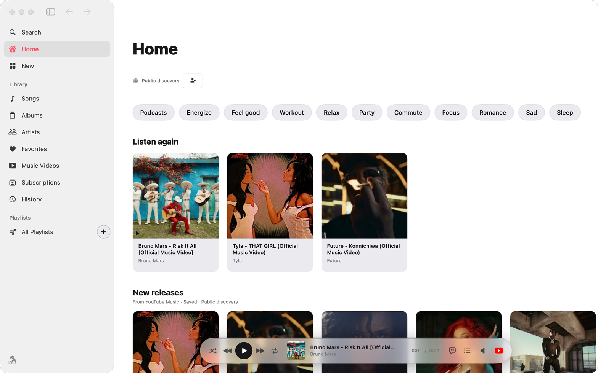

<h1 align="center">Muses-Polyhymnia</h1>

A native Mac home for music from YouTube.

<a href="https://github.com/xiaotwu/Muses-Polyhymnia/releases/latest">Download</a> · <a href="https://xiaotwu.github.io/Muses-Polyhymnia/">Explore the interactive tour</a> · <a href="docs/installation.md">Install guide</a>

**Muses-Polyhymnia** is the standalone macOS project in the Muses family. Polyhymnia is its platform codename; the installed app remains **Muses**.

Muses brings YouTube music, playlists, videos and followed podcasts into a focused macOS app. Browse by artwork, keep favorites and listening history, and play from a queue that remembers the collection you started from.

## Listen your way

- Import YouTube playlists and explore Home, songs, albums, artists, music videos and subscriptions.
- Keep the current collection, **Up Next**, and history distinct; use repeat, shuffle and Smart Shuffle.
- Open **Now Playing** for cover or vinyl artwork and available lyrics. Watch the YouTube video on demand.
- Control playback from the floating player, menu bar, keyboard shortcuts and macOS media controls.
- Follow podcasts, resume episodes, adjust playback speed and skip back or forward.
- Choose an optional personalized Home with explicit browser-session consent. Guest discovery works without it.

The [website](https://xiaotwu.github.io/Muses-Polyhymnia/#tour) includes a keyboard-accessible tour of real app screens. Muses requires **macOS 14 or later**. Download the signed app from the [latest release](https://github.com/xiaotwu/Muses-Polyhymnia/releases/latest); see [installation](docs/installation.md) for setup.

For contributors: [development](docs/development.md) · [project guidance](AGENTS.md). For account and data handling: [privacy](docs/privacy.md). [MIT license](LICENSE).
