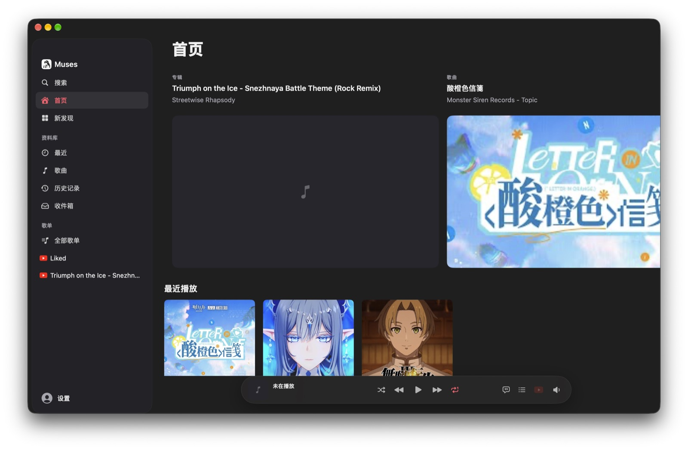

<h1 align="center">Muses</h1>

A quieter place to listen on your Mac.

<a href="https://github.com/xiaotwu/Muses/releases/latest">Download Muses</a> · <a href="https://xiaotwu.github.io/Muses/">Website</a> · <a href="docs/installation.md">Installation</a>

Muses brings your music collections into a focused Mac app. Explore playlists, albums, artists, videos, and followed shows. Keep favorites, listening history, and a queue that remembers where you started.

## Made for listening

- Browse an artwork-led Home and discover something new.
- Move between collections while keeping meaningful Previous, Next, and Up Next behavior.
- Enjoy cover or vinyl artwork, lyrics, and a spacious Now Playing view.
- Control playback from the floating player, menu bar, keyboard, or system media controls.
- Pick up podcasts where you left off, adjust speed, and skip back or forward.
- Watch a video when you want to, and read its comments in a floating panel.

Muses is available for macOS 14 or later. See the [installation guide](docs/installation.md) and [first-release notes](docs/release-notes-0.5.1.md).

For contributors, see [development](docs/development.md). For data and account details, see [privacy](docs/privacy.md).

[MIT license](LICENSE).
