# Muses Rendered Baseline and Runtime Visual Audit

Audit date: 2026-08-16  
Scope: observational runtime audit only; no production source, `AGENTS.md`, dependencies, layout, motion, or visual implementation changed.

The complete evidence index is in [screenshot-catalog.md](screenshot-catalog.md).

## Audit setup

- Project type: SwiftPM SwiftUI/AppKit macOS GUI application.
- Build: `swift build -c release --product Muses` succeeded.
- Bundle staging: the fresh release executable was copied into the repository's existing `build/Muses.app`, then ad-hoc re-signed. The normal `make app` wrapper was intentionally not used because it can refresh generated source-resource files and query/download yt-dlp, which would conflict with this phase's source-read-only constraint.
- Launch target: the actual `build/Muses.app` bundle, not the raw executable.
- Bundle verification: ad-hoc signing verifies successfully with `codesign --verify --deep --strict`.
- Default runtime bounds: 1280×800 at `(0, 39)`.
- Default stable state: dark appearance, Home selected, playback stopped, YouTube artwork available, persistent PlayerBar visible.
- Size matrix: 1600×950, 1280×800, 1000×700, and the runtime-enforced minimum of 829×600.
- Appearance matrix: app Dark and Light; macOS Reduce Transparency, Increase Contrast, and Reduce Motion were each tested and restored to off.
- Runtime data: one imported YouTube playlist, five duplicate song rows for the same track, no albums, no artists, and no user playlist.
- State note: exercising real playback populated the persisted Current Queue and Recently Played surfaces with duplicate instances of the available track. The audit did not rewrite the SQLite store to manufacture or rewind data.
- Worktree: no production source was edited. `git status --short` shows only the pre-existing untracked `AGENTS.md` and this `artifacts/` directory.

## Representative accepted evidence

### Default shell and Home

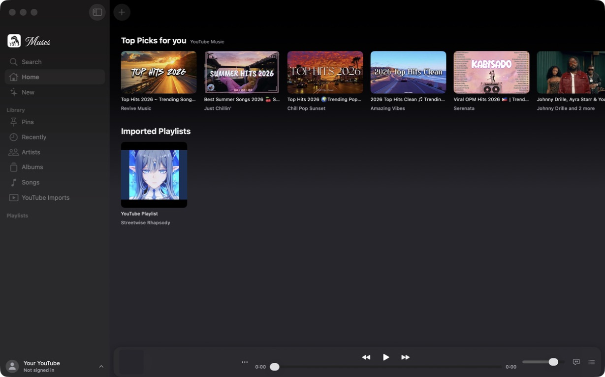

### Home scroll-edge failure

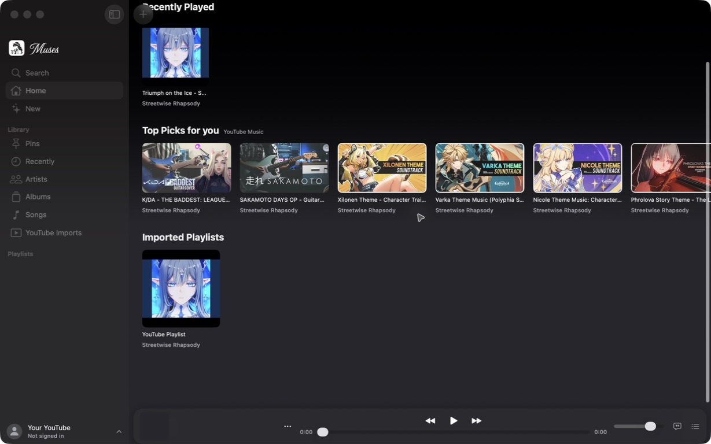

### Search and Queue

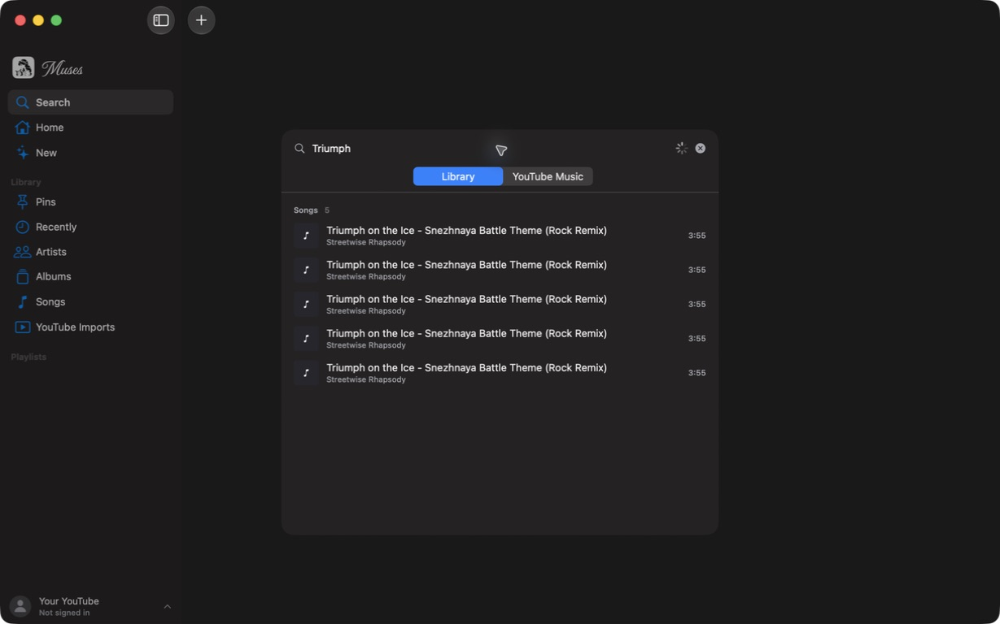

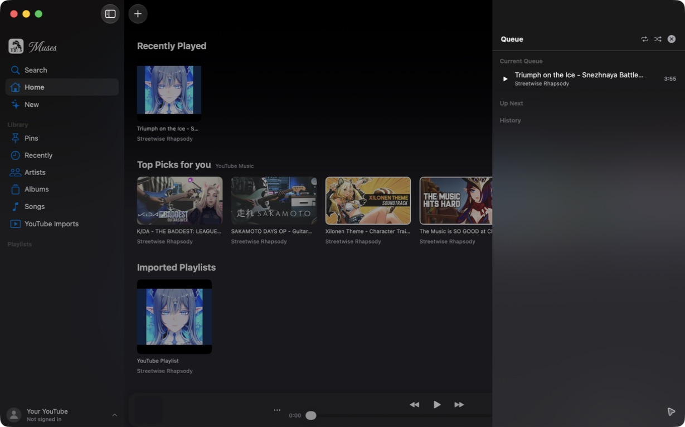

### Strong existing custom surface

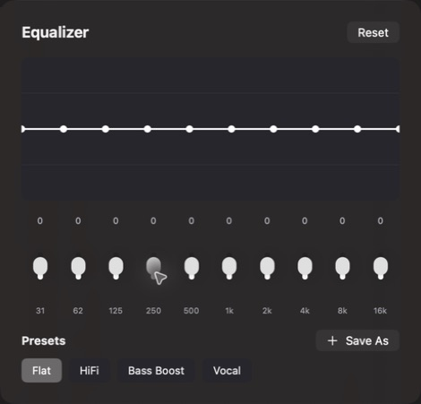

### Light-mode artwork contrast failure

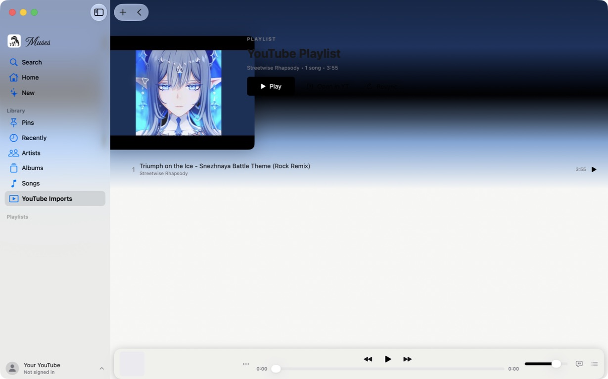

### Size extremes

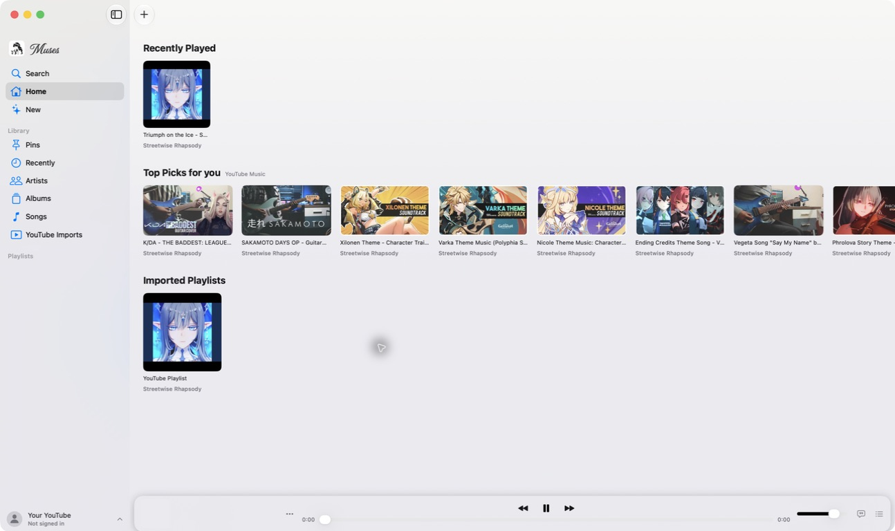

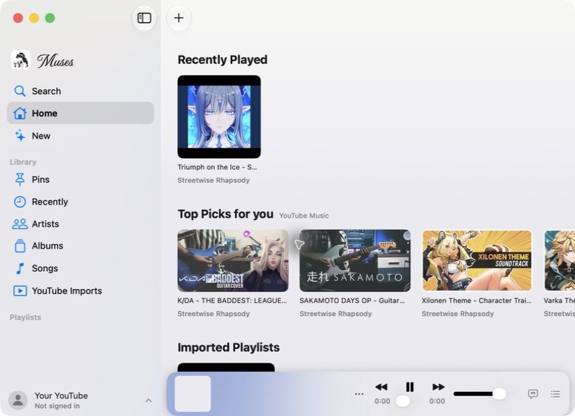

### Now Playing geometry

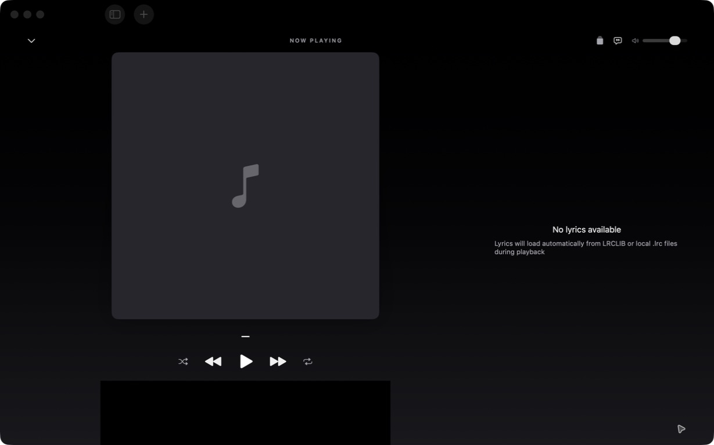

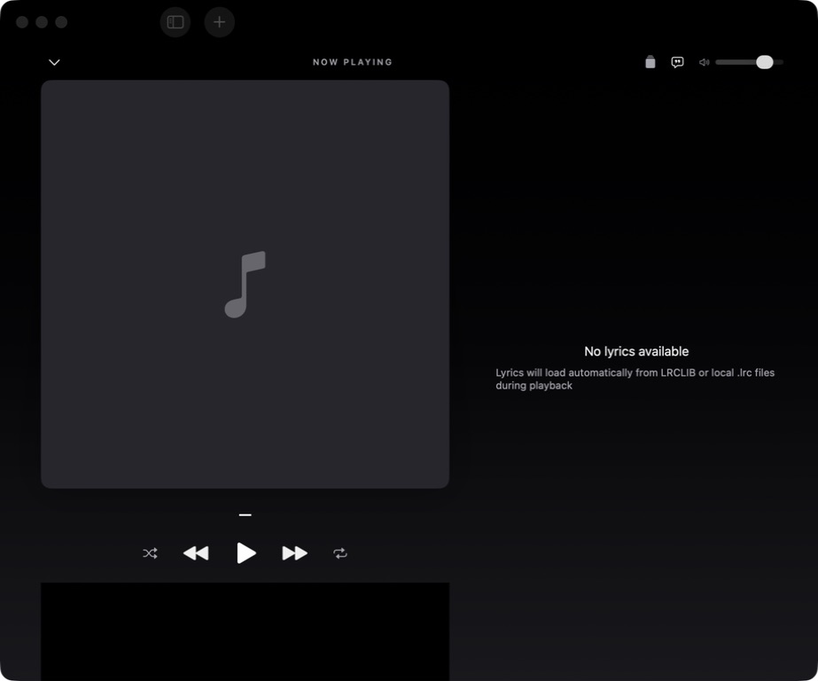

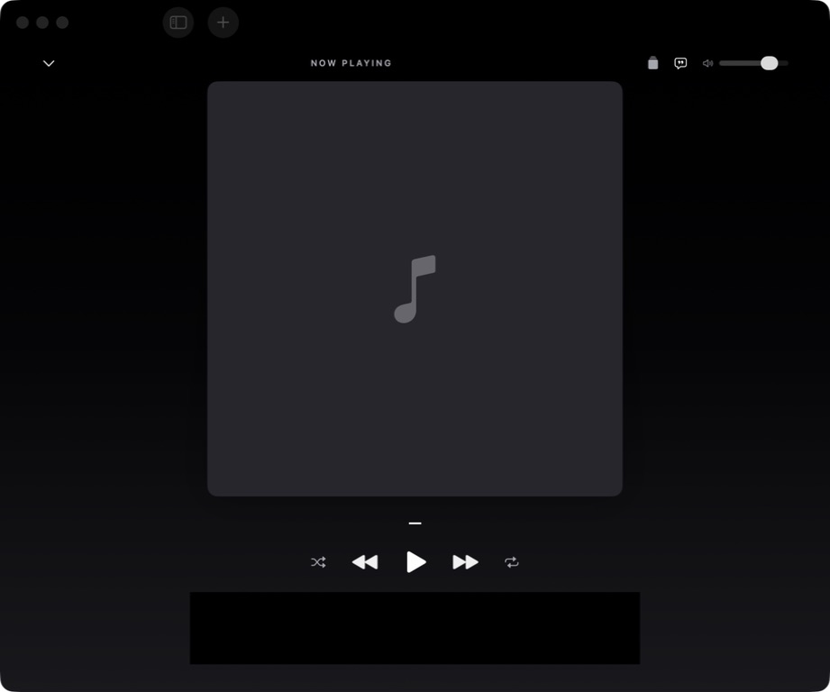

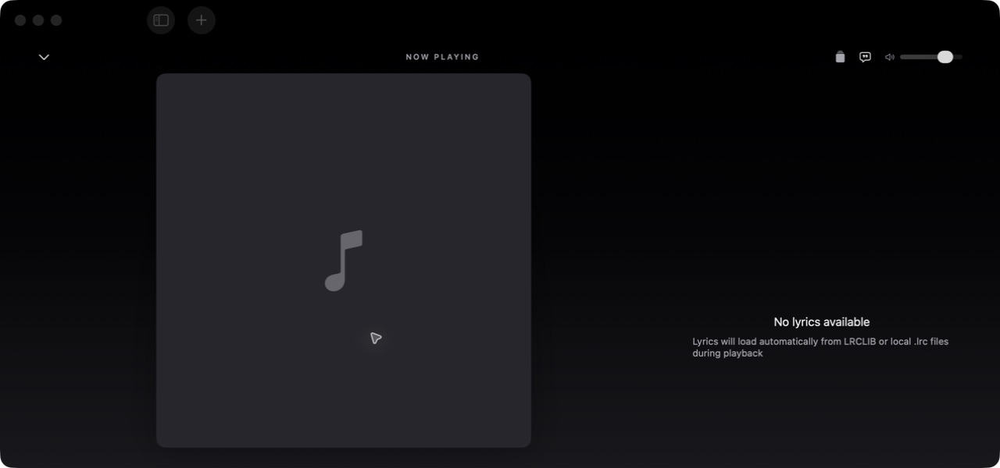

### Accessibility appearance fallback

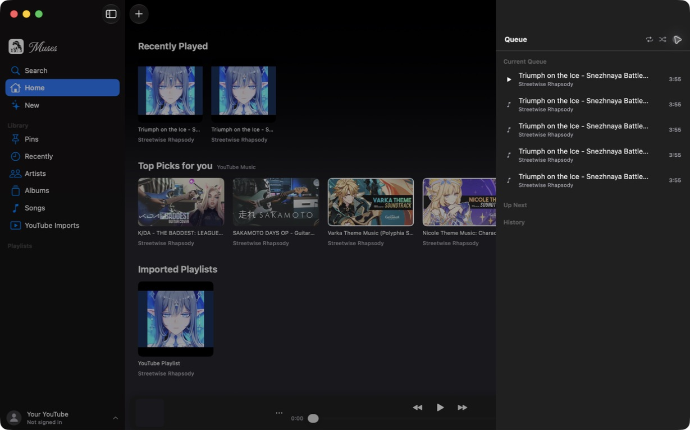

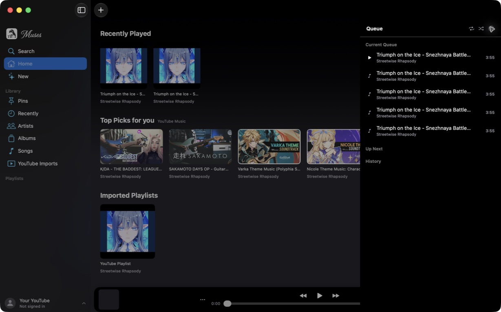

## Evidence limits

This is a real rendered baseline, but not every requested state was available:

- Empty album and artist data prevented card, detail, hover, selection, hero, and playing-row captures for those domains.
- With no playlist, the sidebar's “Playlists” heading was not selectable, so overview/detail/create/add/reorder could not be exercised.
- The only playable media was a YouTube-backed track. Twice, starting it kept the Muses process and MediaRemote updates alive but reduced the process to zero windows. This is repeatable in this capture environment and blocks a trustworthy playing screenshot; it needs manual confirmation before being treated as a product-wide defect.
- Hover-only behavior could not be triggered because the automation surface has no pointer-move-only operation. Source inspection found no explicit `onHover`/`hoverEffect` implementation.
- Screenshots cannot establish VoiceOver correctness or WCAG compliance. Accessibility-tree semantics and keyboard behavior were inspected separately.
- This proves the workspace-local `.app` runtime, not release portability: SwiftPM's resource accessor can fall back to the checkout's `.build` resource bundle, which the current app bundle does not contain.

## Numbered runtime flow and health

1. **Launch and application shell — Healthy with caveats.** The app launches as a real foreground bundle, restores a stable 1280×800 window, and presents a convincing NavigationSplitView/sidebar/toolbar shell.
2. **Home browsing — Mixed.** Artwork, headings, and density are strong; scrolled headings clip beneath the toolbar and the wide layout leaves a large unused field.
3. **Library routes — Incomplete evidence.** Albums and Artists have clear empty states; the data set could not exercise their mature content states.
4. **Songs — Mixed.** Rows are compact and readable, but pointer selection is visually absent and Tab focuses toolbar search rather than rows.
5. **YouTube Imports — Mixed.** The remote/local distinction is excellent; the overview is action-heavy and detail background is visually unsafe, especially in light mode.
6. **Global Search — Poor entry, good panel.** Command-F opens a useful desktop search panel, while the visible sidebar Search route produces a blank page. Keyboard result navigation and Escape dismissal do not work.
7. **Queue — Mixed.** Current Queue / Up Next / History are clear, but the drawer is visually heavy, hides PlayerBar actions, lacks a clear reorder affordance, and does not dismiss with Escape.
8. **PlayerBar — Structurally strong, responsively weak.** The control topology and density are worth preserving; fixed geometry compresses at minimum width and playback capture exposed a serious window-lifecycle blocker.
9. **Now Playing — Expressive foundation, poor reflow.** Vinyl is compelling and the two-column intent is sound. Fixed artwork/spectrum geometry, off-center top labeling, abrupt 960-point switching, and short-window clipping make it the weakest major rendered surface.
10. **Settings and EQ — Healthy.** Settings is more convincingly native than expected; EQ is one of the strongest current custom surfaces. Appearance grouping is the notable visual debt.
11. **Sheets and popovers — Healthy.** Import, metadata, and profile surfaces render compactly and mostly opaquely; redundant material is a source concern more than a severe runtime problem.
12. **Appearance and accessibility fallbacks — Mixed but usable.** Light mode is generally readable, Reduce Transparency and Increase Contrast produce usable opaque surfaces, but artwork gradients do not have a reliable foreground-contrast contract.
13. **Active playback — Blocked / high risk.** The process remains running after the window disappears. This must be confirmed manually before visual implementation begins because it prevents reliable playback-surface verification.

## A. Overall runtime impression

Muses currently feels like a real, information-dense macOS utility with a mature playback model rather than a prototype. The sidebar, toolbar, native lists, sheets, keyboard focus ring, context menus, sliders, and form controls establish credible macOS behavior. Artwork gives the product identity without overwhelming most browsing surfaces.

The visual character is restrained and coherent, but uneven. Calm browsing and dense controls often work well; the most expressive surfaces rely on fixed geometry and broad artwork gradients that do not reflow or protect legibility. The app is therefore stronger as a desktop library manager than as an immersive playback experience today.

## B. Strongest existing visual elements

1. **EQ editor.** Its restrained graph, ten compact bands, presets, and opaque chart surface form the best-balanced custom UI in the app.
2. **Native shell.** NavigationSplitView, source-list selection, toolbar controls, window chrome, sheets, and visible keyboard focus establish a genuine macOS baseline.
3. **Dense search and song-row typography.** Title/artist/duration hierarchy is compact and readable for long sessions.
4. **YouTube local-addition semantics.** The expanded import copy makes the remote-versus-local ownership distinction exceptionally clear without decorative clutter.
5. **PlayerBar information architecture.** Artwork/metadata, transport/timeline, and volume/auxiliary controls form the right desktop topology.
6. **Vinyl rendering.** Grooves, label geometry, shadow, and scale provide the strongest expressive visual moment currently rendered.
7. **Native sheets and profile popover.** Their materials render mostly opaque and visually settled, with familiar control placement.

## C. Weakest existing visual elements

1. **Active playback window lifecycle.** The available YouTube playback path twice left Muses running with zero windows. Even if capture-environment-specific, it blocks confidence in the primary experience.
2. **YouTube detail environment.** Broad horizontal palette bands compete with artwork and content; light mode produces an obvious contrast failure across the hero title and actions.
3. **Now Playing geometry.** Fixed 480-point media, clipped spectrum, hidden lower controls, and an abrupt breakpoint produce visible layout failures.
4. **Search entry and keyboard interaction.** Sidebar Search is blank; Down does not select results; Escape does not dismiss.
5. **Home scroll edge.** Section titles pass under and clip against toolbar controls.
6. **Empty Playlists navigation.** The visible “Playlists” label is not a usable route without existing data.
7. **Queue layering.** Queue invoked while Now Playing is visible exists behind it and becomes visible only after Now Playing closes.
8. **Pointer language.** Ordinary cards, rows, and icon controls show little or no explicit hover response; row focus and selection are weak.

## D. Responsive layout findings

| Runtime size | Result |
|---|---|
| 1600×950 | Calm and usable, with more Top Picks visible; also exposes large unused lower space and a weak relationship between sections and window scale. |
| 1280×800 | Best overall browsing balance. PlayerBar fits and Search/Queue have reasonable proportions. |
| 1000×700 | Browsing remains usable. PlayerBar begins to feel compressed; bottom content is crowded and Now Playing loses lower playback content. |
| 829×600 | First practical failure. PlayerBar metadata space effectively disappears; Queue consumes about 43% of the window; fixed Search only just fits. |
| Now Playing 961×800 | Two-column layout remains active even though fixed geometry exceeds comfortable width; top “NOW PLAYING” label is visibly off-center. |
| Now Playing 959×800 | A two-point change triggers a large spatial jump to one column; lyrics move below the spectrum and require scrolling. |
| Now Playing 1280×600 | Artwork and lyrics remain, but metadata, transport, timeline, and spectrum disappear below the window. |

The 960-point breakpoint is therefore not merely inelegant; it changes information availability and control discoverability.

## E. PlayerBar findings

The rendered bar feels approximately 64 points high and sits eight points inside the detail column. It is clearly separate from the sidebar and correctly reserves scroll space. At baseline width, 52-point artwork, a fixed metadata block, central transport/timeline, and trailing volume/lyrics/queue controls feel compact and desktop-appropriate. Standard sliders and the system overflow menu should survive the visual transformation.

Its weaknesses are primarily geometry and interaction:

- Long metadata truncates acceptably at 1280 but the entire metadata role becomes expendable at 829.
- Empty-state controls remain enabled-looking, with 0:00 / 0:00 and no explicit unavailable state.
- Hover/pressed/focus response is largely the system default and often invisible against dark material.
- Queue covers the entire trailing control area rather than visually relating to the bar.
- Light mode produces better bar separation than dark mode; Reduce Transparency makes it opaque but still weakly separated from the root.
- A real playing screenshot could not be accepted because initiating playback removed the app window. The paused/loaded capture remains the valid visual baseline.

## F. Now Playing findings

Now Playing is already treated as the expressive surface, but it is not yet resilient enough to carry that role.

- **Artwork scale:** fixed 480-point cover/vinyl is impressive at 1280×800, marginal just above 960, and incompatible with short windows.
- **Artwork sharpness:** the available YouTube art is crisp in browsing/detail captures; placeholder mode is clean but visually vacant.
- **Environment:** without a current track, the background is nearly black and restrained. The artwork-rich YouTube detail suggests the palette pipeline can become excessively banded and contrast-unsafe.
- **Metadata and transport:** the dash/title and transport float directly on the environment. At 1280×600, the entire control/metadata stack falls out of view.
- **Lyrics:** the empty state is readable in wide layout. Below the breakpoint it moves after the spectrum and requires scrolling.
- **Spectrum:** it renders as a large opaque black rectangle, visibly clipped at the bottom in every captured Now Playing layout. This is more severe than the source-only geometry concern implied.
- **Vinyl:** visually strong and worth preserving, but a blank gray label is weak with no track.
- **Top bar:** the nominally centered label is visibly left-shifted because asymmetric leading/trailing content is balanced with Spacers rather than geometric centering.
- **Queue:** Command-K while Now Playing is open adds Queue controls to the accessibility tree but no visible drawer; closing Now Playing reveals it underneath.
- **Transition:** the PlayerBar-to-Now-Playing change reads as a simple overlay replacement rather than continuity between the same artwork and controls.

## G. Native macOS findings

Muses feels most native in its shell, Settings, EQ sheet, import sheets, context menus, sliders, source list, and keyboard focus. The visible blue accent is more prominent at runtime than the earlier “mostly monochrome” characterization suggested: selected sidebar rows, focus rings, toggles, segmented controls, and radio buttons rely heavily on the macOS accent color.

The least native-feeling behaviors are the blank sidebar Search route, unavailable empty Playlists route, gesture-only selection, missing Escape handling, and custom overlays that do not behave like inspectors or command panels at the keyboard level.

## H. Material findings

Existing `.ultraThinMaterial` does not render as generic web glass:

- Profile, Settings, Import, YouTube Import, and metadata sheets look almost opaque. Their extra material layers are technically redundant, but not a severe visual problem in the current OS rendering.
- PlayerBar material is subtle and physically separated by its inset/shadow; its dark-mode contrast is weaker than light mode.
- Queue samples the content behind it strongly enough to become a muddy colored wall when content is sparse.
- Search is translucent but visually stable because it is compact and centered.
- Reduce Transparency produces usable opaque sidebar, PlayerBar, and Queue surfaces automatically.
- Increase Contrast makes Queue and PlayerBar nearly black and strengthens separators, despite the custom `hairline` color being transparent in normal appearances.

This runtime evidence reinforces “replace, do not stack” for future glass work, but lowers the urgency of removing redundant material from small native sheets solely for visual reasons.

## I. Motion findings

The visible motion language is sparse:

- Search scales/fades in; Queue slides from the trailing edge; Now Playing fades over the shell.
- No artwork continuity is visible between browsing, PlayerBar, and Now Playing.
- No explicit card or row hover motion was found or observed.
- Vinyl and spectrum are the intended ambient motion surfaces, but active playback could not be captured after the window-lifecycle failure.
- Reduce Motion leaves the static Now Playing composition unchanged. The audit could not verify live vinyl/spectrum or lyric-scroll fallbacks.
- Search and Queue still lack Escape dismissal regardless of motion preference.

The current experience therefore feels mostly abrupt rather than excessively animated.

## J. Accessibility and appearance findings

- **Dark mode:** generally legible and appropriately restrained. Some materials and the root merge too closely.
- **Light mode:** browsing, Settings, and PlayerBar remain readable. YouTube detail fails visibly because the artwork gradient places dark text/actions across a black band and then fades into an overly pale field.
- **Increase Contrast:** system rendering strengthens separators and makes transient surfaces almost black; functional hierarchy remains usable.
- **Reduce Transparency:** opaque surfaces remain readable. PlayerBar loses some physical separation from the dark root, but Queue becomes clearer.
- **Reduce Motion:** static layout is unchanged; live fallback behavior remains unverified.
- **Keyboard:** Tab exposes a strong focus ring on toolbar search, but song rows and Search results do not form a useful keyboard path. Down arrow does not select Search results. Escape does not dismiss Search or Queue.
- **Pointer:** single-click Song rows have no obvious selection feedback; hover-only states could not be directly exercised.
- **VoiceOver risk:** the accessibility tree exposes several generic descriptions (“Bubble,” “Stack Of Squares, Filled,” “Repeat 1”) and the current-playing Queue row needs a stronger state value. Full VoiceOver testing remains outstanding.

## K. Corrections to the previous Liquid Glass audit

| Previous conclusion | Runtime classification | Correction |
|---|---|---|
| PlayerBar fixed geometry is a narrow-window risk. | Confirmed | At 829×600 the metadata role collapses and controls crowd together. |
| Now Playing fixed 480-point artwork is too rigid. | Confirmed, more severe | At 1280×600 all playback controls disappear; the 961/959 switch changes content availability. |
| Spectrum has a 48/120 geometry conflict. | Confirmed, more severe | It is a large black rectangle clipped by the bottom edge in every captured layout. |
| Now Playing top label may not be geometrically centered. | Confirmed | It is visibly left-shifted at both wide and breakpoint widths. |
| Queue may render underneath Now Playing. | Confirmed | Command-K adds hidden Queue accessibility controls; closing Now Playing reveals the drawer. |
| Search structure is strong but keyboard support is weak. | Confirmed | The panel is good; Down and Escape fail. A new, higher-priority bug is the blank sidebar entry route. |
| Queue material is visually heavy. | Confirmed | Runtime sampling creates a muddy wall; opaque accessibility fallbacks are clearer. |
| Settings should urgently move to a more native shell. | Partially confirmed | Settings already looks convincingly native. Nested Appearance grouping is the visible issue; scene architecture is lower visual priority. |
| Profile/sheet material is visibly redundant. | Partially confirmed | Source redundancy remains, but macOS renders these layers nearly opaque and visually settled. |
| Mostly monochrome color model is current identity. | Partially confirmed | Artwork remains the primary color source, but system blue is a strong functional accent throughout selection/focus/control states. |
| Artwork gradient legibility is risky in light mode. | Confirmed, dramatically | YouTube detail shows a clear black-band title/action failure in light appearance. |
| Home needs richer environmental art. | Partially confirmed | Sparse data makes Home calm; the bigger immediate issues are scroll clipping, unused space, and right-edge affordance. |
| Album/artist hover and card restyling are priorities. | Not confirmed at runtime | No album or artist data existed, so source-only conclusions remain hypotheses. |
| Native sheets should remove inner material. | Directionally valid, lower urgency | Runtime appearance is already compact and native; replacement should occur only as part of a coherent system-glass pass. |

## Visual debt by category

### Geometry

- Fixed PlayerBar metadata/volume/control widths.
- Fixed 360-point Queue drawer.
- Fixed 560×520 Search panel that only just fits the minimum window.
- Fixed 480-point Now Playing media and hard 960-point breakpoint.
- Spectrum frame clipping and short-window loss of controls.
- Redundant nested Settings Appearance panels.

### Hierarchy

- YouTube Imports overview has no strong page title and too many equal-weight card actions.
- Queue rows have little differentiation beyond a tiny play/note glyph.
- Now Playing transport, metadata, quality, and visualization lack distinct surface roles.
- Empty PlayerBar still reads as fully actionable.

### Material

- Queue is the clearest example of material overpowering content.
- PlayerBar dark separation is weaker than light.
- Small sheet materials are redundant in source but visually low severity.

### Color

- YouTube detail palette bands are uncontrolled and unsafe in light mode.
- Playing/selected/quality states remain weakly differentiated beyond system blue or monochrome symbols.
- Artwork remains an effective primary color source on Home.

### Motion

- Related surfaces replace one another without continuity.
- Presentation ownership is simple but disconnected.
- Live fallback behavior under Reduce Motion could not be verified.

### Interaction

- Sidebar Search blank route.
- Empty Playlists route unavailable.
- No Search result keyboard navigation/default action.
- Search and Queue ignore Escape.
- Song single-click selection is visually absent.
- Queue reorder exists structurally but has no visible handle or edit state.
- Queue is hidden beneath Now Playing.

### Accessibility

- Light artwork-gradient contrast failure.
- Weak keyboard path through rows and results.
- Generic image-only control descriptions.
- Hover-only future actions would require keyboard and VoiceOver equivalents.
- Active playback/Reduce Motion/VoiceOver could not be fully tested while the app window disappeared.

## L. Highest-value future visual changes

These are priorities for a later implementation phase, not changes made during this audit:

1. Confirm and isolate the playback/window disappearance before any hero-surface work.
2. Recompose Now Playing responsively, including spectrum, short-height behavior, geometric title centering, and the 960-point transition.
3. Establish a contrast-safe artwork environment for YouTube detail and Now Playing in both appearances.
4. Repair Search entry, keyboard selection, default action, and Escape behavior before adding presentation polish.
5. Make PlayerBar responsive while preserving its three-part desktop topology.
6. Correct Home scroll-edge clipping and make wide-layout whitespace intentional.
7. Resolve Queue layering and presentation so it relates coherently to PlayerBar and Now Playing.
8. Preserve the EQ editor, native Settings density, standard controls, and clear remote/local YouTube semantics as transformation anchors.

## Final baseline conclusion

The runtime confirms that visual complexity belongs primarily in Now Playing, artwork-led detail, and a future responsive PlayerBar. Browsing, Settings, sheets, dense rows, and menus should remain calm. Before Liquid Glass implementation, the highest-risk prerequisites are the active-playback window lifecycle, Now Playing reflow/spectrum geometry, Search entry/keyboard behavior, and light-mode artwork contrast.
