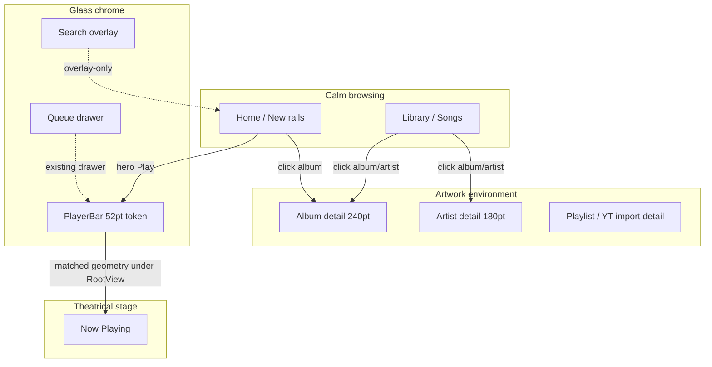
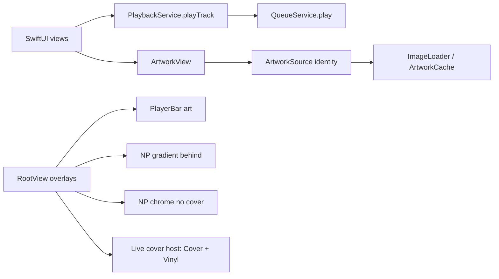
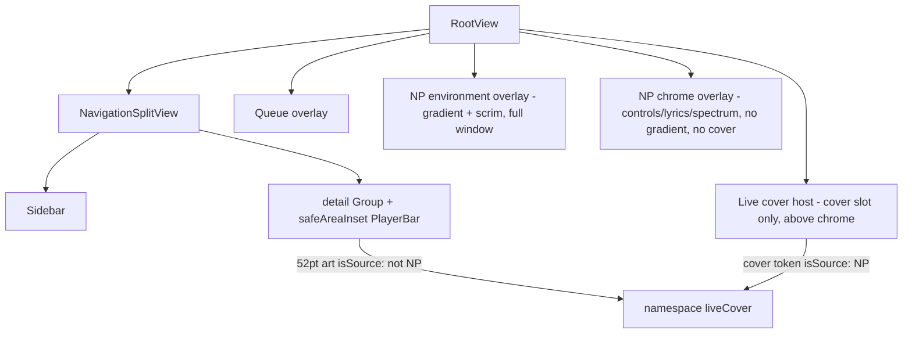
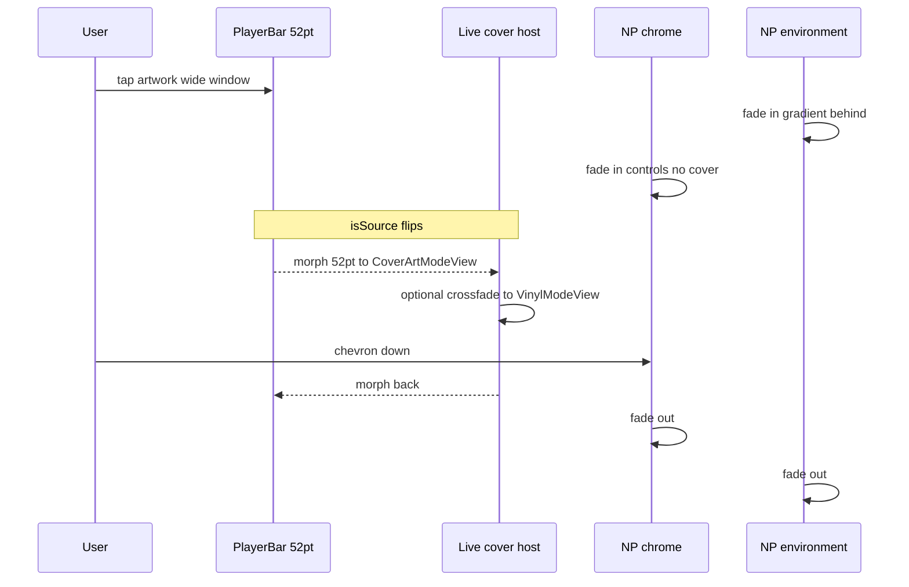

# Muses — Artwork-World Overhaul Design

- **Date**: 2026-08-18
- **Status**: Draft (pending user review)
- **Path**: `docs/superpowers/specs/2026-08-18-muses-artwork-world-overhaul-design.md`
- **Repo**: `/Users/xiaotwu/Code/xyz`
- **Platform**: macOS 14+ (Sonoma), Apple Silicon native
- **Distribution**: personal (Developer ID + notarization + Sparkle), not App Store
- **Relation to current work**: the working tree already contains uncommitted Liquid Glass work. This spec is the *next* visual/HCI overhaul. It does not reopen or rewrite `App/GlassSurface.swift` / `GlassRole`. Glass remains chrome. Artwork becomes the physical object.

This document turns two user-approved chat sections into an implementable spec. Product direction is locked. Historical plans and the 2026-08-11 music-player design describe intent; current executable source is the truth for APIs, file paths, and call sites.

## 1. Overview

Muses already has a mature native macOS music product: collection-context playback through `PlaybackService.playTrack(_:context:from:)`, a persistent glass PlayerBar, artwork-led browsing, and a theatrical Now Playing stage. The browsing layer does not match that maturity. Cards decode `NSImage` inside `body`, Home Recently Played and some play buttons build a one-song queue, empty states advertise the wrong shortcut, sidebar Search flashes `EmptyView`, Search/Queue ignore Escape, failed Home rails have no Retry, and there is no hover Play, no durable song-row selection, and no artwork continuity between PlayerBar and Now Playing.

This overhaul is **Approach A — Artwork-world**. Artwork is the physical object. Glass is chrome (`GlassRole` on PlayerBar, Search, Queue, compact controls). Motion is continuity, not decoration. Four shared primitives — Album, Artist, Song, Hero — replace the scatter of `AlbumCard`, `DiscoveryCard`, `RecentTrackCard`, `ArtistCard`, unused `SongCompactRow`, and live `TrackRow` / `SongRow` / `PlaylistTrackRow`. A first HCI pass fixes play-context and chrome bugs against existing APIs. Artwork decode is split from the object swap so the high-risk `ArtworkSource` identity change is independently revertible. Later PRs add hover Play, now-playing identity, row selection, and a RootView-hosted cover morph from PlayerBar 52pt art → Now Playing cover.

This is not an Apple Music pixel clone, not glass-on-every-card, and not a playback-engine or SwiftData rewrite.

## 2. Key Decisions

Locked in the approved chat sections, plus per-surface interaction that those locks require. Implementers must not reopen Approach A, glass-on-cards, engine rewrites, or YouTube one-item discovery context.

| Decision | Choice | Rationale |
|---|---|---|
| Approach | **A — Artwork-world**. Not Apple Music clone (B). Not animation overlay on broken HCI (C). | Artwork is the object; glass is chrome; motion is continuity. Matches Muses identity and `Agents.md` visual hierarchy. |
| Expression gradient | Library / Songs / Search results stay dense and calm. Home / New rails get larger covers + hover Play. Album / Artist / Playlist detail is an artwork environment. PlayerBar is persistent glass; the cover is a live token. Now Playing is the only theatrical stage. | Intensifies the existing gradient. Browsing must not compete with Now Playing. |
| Shared objects | Four primitives: Album (square), Artist (circle), Song (row), Hero (Home featured). | Replaces ad-hoc cards. One decode path via `ArtworkView` / `ArtworkSource`. |
| Playlist / import geometry | **Browse** playlists (`PlaylistsView.PlaylistCard`, Pins playlist tiles) and Home `YouTubeImportCardSmall` reuse Album-square geometry. **`YouTubeImportCard` (overview management row: resync / Open in YT / delete / play all / expand) stays.** Import ownership and deletion semantics do not change. | Locked “playlists and YouTube imports reuse album-square geometry” applies to *browse* objects, not the management chrome. Flattening `YouTubeImportCard` would destroy a product contract. |
| Hover Play | A control **on the artwork**, not a card-wide play. Click elsewhere still navigates (album/artist/playlist) or follows the song-click matrix below. | Preserves desktop click-to-open. Play is explicit. |
| Song click vs select | **Per-surface matrix, not a single click rule.** “Click plays with the visible list as context” constrains the **queue array** passed to `playTrack` on every play path. It does not force tap-to-play onto lists that do not have it today. See the matrix in this table’s next rows and §5.3.5. | Honors both locked phrases and `Agents.md` mature workflows. Durable selection is new; play-on-click is not invented on playlist/import rows. |
| Album / artist detail rows | Single click = **select and play** the visible list (`from: .album` / `.artist`). That is today’s `TrackRow` `.onTapGesture { play(track) }`. Hover Play and context-menu Play are the same play path. | Locked “click plays.” Existing tap-to-play. |
| Songs list | Preserve today’s **double-click / Return to play**. Single click **selects** (`List` selection). Hover Play and context-menu Play also play the **visible sorted/filtered list**, `from: .songs`. | `SongRow` already plays only on `.onTapGesture(count: 2)` (`LibraryView.swift` ~231). Changing that to tap-to-play would regress a mature desktop list. |
| Playlist / YouTube-import rows | Play stays a **control** (in-row Play, Hover Play, context-menu Play). Row click **selects** (or is a no-op besides selection). **Do not invent tap-to-play** on those lists. In-row Play uses `playFromList` / `allSnaps`, never `context: [snap]`. | Today `PlaylistTrackRow` and `YouTubeAlbumTrackRow` / `YouTubeImportItemRow` only play from a button. Tap-to-play would collide with `.onMove` and remove. |
| Visible-list context | Every play path that is in scope passes the **visible collection** as `context:` to `playTrack`. That is the lock. Click vs button vs double-click is per surface. | Fixes one-song queues without rewriting engines. |
| Now-playing identity | Song / `.play` rails: compare `playback.state.track?.id` to the snap id. Album objects: `playingAlbumID == album.id` where `playingAlbumID` is resolved **once per surface** via `library.track(by: playingID)?.album?.id`. Artist objects: same with `artistRef?.id`. Reads live in a tiny child that touches **only** `track?.id` / `isPlaying`. No neon ring. No `position` / spectrum subscription. | `TrackSnapshot` has no album/artist UUID (`QueueItem.swift` ~51–67). Do not add SwiftData fields. Do not fetch per card in `body`. |
| Motion | One `@Namespace` on `RootView`. **PR 5 path:** PlayerBar 52pt → Now Playing cover. The **live-cover host owns all cover presentation** (`CoverArtModeView` and `VinylModeView`) and sits **above** NP chrome (see §5.5.2). **Card → detail is out of PR 5.** Skip morph on Reduce Motion, `lyricsFullscreen`, no track, or **width < 960pt** (narrow keeps the in-scroll cover). Hover: 120–180ms ease, lift a few points, no bounce, no idle motion. Queue stays a drawer. Vinyl/spectrum stay Now Playing–only. | Continuity, not decoration. Narrow window must not fight `ScrollView`. |
| Search chrome | Search is **overlay-only**. Sidebar Search is an action, not a content destination. Selection never sticks on `.search`. Detail never renders `EmptyView`. | Fixes the blank-page flash at `RootView.swift` ~55–58 without inventing a Search page. |
| Search result rows | Overlay rows may keep private types. They must **display via `ArtworkView`**. They are **not** required to be `SongObjectView` / `AlbumObjectView` in the object-swap PR. | Expression gradient still applies; overlay density stays command-palette, not a library grid. |
| Escape | Escape dismisses Search and Queue. Search field: Escape still dismisses the overlay (not merely clear). Rename-group alert keeps system Escape. Verify with the field focused. Fallback: field-level `onKeyPress(.escape)` if `.onExitCommand` is swallowed. | Baseline `25-search-escape-not-dismissed`. Not a global key monitor. |
| Recently Played context | `playTrack(snap, context: recentlyPlayed, from: .recently)` — the full `recentlyPlayed` array, not `[snap]`. | Collection-context playback is already a product contract. The bug is the call site. |
| Playlist row Play | Same list context as `playFromList` (`PlaylistDetailView.swift` ~138–141). | The in-row play button at ~163–165 is the only broken sibling on that page. |
| Home rail failure | Keep the failed section. Add Retry. On Retry, show in-section loading (view-local) then `reload()`. Loaded-empty rails **hide the whole section including the header**. | Distinguishes error from empty. Uses existing `HomeDiscoveryService.reload()` / `loadTrending()`. |
| Empty-state shortcut | ⌘F is Search. ⌘K stays Queue. Copy must match `MusesApp` command bindings. | Menus already bind Search to ⌘F and Queue to ⌘K. |
| YouTube discovery | May keep 16:9 geometry and one-item context after `importAsTrack`. | Locked leave-unchanged. Not converted to Album object. |
| Queue / History / Inbox | Queue item activation stays a queue jump (do not add a new one-song collection). History and Inbox one-shot play may stay. | Out of this overhaul’s play-context fixes. |
| Data model | **No SwiftData schema changes.** `TrackSnapshot` gains no new persisted fields. | Visual/HCI only. Queue JSON stays compatible. |
| Feature flag | None. Incremental PRs on main. Rollback = revert PR. | Personal-distribution app. Existing `PrefKey.ffDiscovery` / `ffSituationalNew` stay as they are. |
| Glass | Do not glass-morph browsing cards. Do not put `musesGlass` on Album/Artist/Song/Hero. | Liquid Glass pass already defined `GlassRole` for chrome. |
| Engines | Do not touch `PlaybackService` internals, `LocalAudioEngine`, `YouTubeStreamEngine`, queue persistence, OAuth, or yt-dlp. UI may *call* `playTrack`. PR 5 must not edit `PlaybackService`, `NowPlayingManager`, or vinyl math. | High-risk systems. Visual work must not hide engine refactors. |
| PR 3 split | **3a** = `ArtworkSource` identity + `ArtworkView` / `ImageLoader` + compile-fix every matcher. **3b** = primitives + call-site swap, `showsHoverPlay = false`. HCI (PR 2) stays separate. | Identity change is High risk (`Agents.md` incremental). A revert of objects must not revert decode. |

## 3. Background & Motivation

### 3.1 Current state (source-confirmed)

Muses is past the 2026-08-11 music-player design. The composition root is `MusesApp`. `PlaybackService` is the only playback facade:

```swift
func playTrack(_ track: TrackSnapshot, context: [TrackSnapshot], from: QueueSource)
```

`QueueSource` is `album | playlist | import | search | songs | artist | recently` (`Domain/Enums.swift`). Album detail, artist detail, songs list, search library results, and YouTube import *detail* `playItem` / `playAll` already pass the visible collection. Several browsing call sites do not.

Artwork is first-class in product language but not in code. `ArtworkView` / `ArtworkSource` exist (`Features/NowPlaying/ArtworkSource.swift`) and are used by Now Playing, Mini Player, Up Next preview, and derived browse cards. `ArtworkView` currently pattern-matches `.cached(NSImage)` and loads remotes with `AsyncImage`, **not** `ImageLoader`. Local library cards still decode in `body`:

```swift
// LibraryView.AlbumCard ~79–83, ArtistsView.ArtistCard ~104–110,
// HomeView hero ~150–151, RecentTrackCard ~455–457, DiscoveryCard ~55–57,
// SongCompactRow ~58–59, PlayerBar ~49–51, AlbumDetailView ~113–114,
// GlobalSearchView rows ~266 / ~296 / ~319
NSImage(byReferencing: path)   // or NSImage(contentsOf:)
```

`ArtworkSource.resolve` itself still constructs `NSImage(byReferencing:)` synchronously. `NowPlayingView.extractGradient()` (~337–365) switches `.cached(let img)` and runs `AlbumArtworkExtractor` **on the main actor**. Home hero gradient is the correct pattern: `HomeView.updateGradientAsync()` reads bytes on a detached task, then extracts color on the main actor, gated by `PerfTrace.event("home.gradientReady")`.

Motion today is opacity. `RootView` presents Now Playing with `.transition(.opacity)` and `.animation(.easeInOut(duration: 0.25), value: showNowPlaying)`. PlayerBar lives in the split-view `safeAreaInset`; Now Playing is a **root overlay**. There is no `matchedGeometryEffect` in the app target. `lyricsFullscreen` removes `leftColumn` (the cover). Vinyl art is a ~0.6× disc inside `VinylModeView`, not the 480pt rounded rect.

Glass is already role-based (`App/GlassSurface.swift`): `floatingControl`, `player`, `overlay`, `compactControlGroup`, `panel`. PlayerBar uses `.player`. Search and Queue use `.overlay`. That pass stays.

`SongCompactRow` has **zero production call sites** (definition + skeleton comment only). `TrackRow` is live in album detail, artist detail, and orphan `LikedView` (`LibraryView.swift` ~277; no RootView/Sidebar reference). `PlaylistsView.PlaylistCard` is a 60pt list row with pin/delete. `YouTubeImportCard` is an 80pt management row. `YouTubeImportCardSmall` is already ~140 square.

### 3.2 Product diagnosis (PM review — background, not extra scope)

**Critical (this spec’s HCI PR):**

- Home discovery failures look broken. Runtime copy is `tr("Couldn’t load this section", "无法加载该区段")` with no action (`HomeView.swift` ~298–301).
- Recently Played plays a one-song collection (`HomeView.swift` ~225: `context: [snap], from: .recently`).
- Empty states say ⌘K for Search (`LibraryView.swift` ~28, ~129). Menus bind Search to ⌘F and Queue to ⌘K (`MusesApp.swift` ~395–403).
- Sidebar Search is a content destination that renders `EmptyView` then flips to Home (`RootView.swift` ~55–58). Baseline: `20-sidebar-search-blank-dark.png`.
- Zero `onHover` / `hoverEffect` on music objects.
- Song rows have no durable selection. `SongsListView` plays on double-click; album `TrackRow` plays on tap; playlist/import rows play from a button; none keep a selected-but-not-playing row.

**High (covered only insofar as objects / motion / HCI above cover them):**

- Cards lack Play-on-hover and now-playing identity.
- PlayerBar → Now Playing is opacity, not a cover morph.
- Empty vs error vs loading is collapsed on failed rails.
- Escape does not dismiss Search or Queue.

**Do not expand to:** new Home IA, rewriting New vs Home, glass-on-cards, cloning Apple Music For You, rewriting engines, ambient animation everywhere, or Figma.

### 3.3 Pain points this overhaul exists to fix

1. **HCI lies.** Shortcuts, Search, Escape, and play context disagree with the menus and with `Agents.md` collection-context playback.
2. **Objects are not objects.** Six card implementations, three sizes, two decode paths, no hover, no playing mark.
3. **Continuity is missing.** The PlayerBar 52pt cover and the Now Playing 480pt cover are the same physical object in the product language and two unrelated images in code.

## 4. Goals & Non-Goals

### 4.1 Goals

- Lock the artwork-world principles into `Agents.md` / `AGENTS.md` (duplicate files; keep them identical).
- Fix the approved HCI table against current APIs, with tests for play-context arrays.
- Change `ArtworkSource` to identity and make `ArtworkView` the only display path (PR 3a), independently of chrome swap.
- Introduce Album / Artist / Song / Hero primitives, swap every listed call site, delete the old cards after swap (PR 3b).
- Keep decode, resize, and palette work off SwiftUI `body`.
- Add hover Play on artwork, now-playing identity, and durable song-row selection.
- Morph PlayerBar art ↔ Now Playing cover through a RootView-hosted matched pair. **Not** card → detail in this overhaul’s PRs.
- Polish Home / New type scale and hero; verify in the rendered app (dark / light / wide / narrow / Reduce Motion / Reduce Transparency).

### 4.2 Non-Goals

- `PlaybackService` internals, `LocalAudioEngine`, `YouTubeStreamEngine`, `NowPlayingManager` observation loops, spectrum FFT, vinyl rotation math, queue persistence, SwiftData schema, OAuth, yt-dlp, packaging.
- New Home information architecture. New vs Home stay as they are (`HomeView`, `NewView`).
- Glass on cards. Glass-morph of browsing cards. New `GlassRole` values unless a chrome hole is discovered (none expected).
- Featured-artist headers, top-songs shelves, Apple Music For You, ambient particle/idle motion.
- Changing YouTube discovery 16:9 cards to square, or giving them multi-item context after `importAsTrack`.
- Flattening `YouTubeImportCard` management chrome into `AlbumObjectView`.
- Changing Queue item activation into a new collection. Adding a `QueueService.jump` API unless a later PR truly needs row activation (not required here).
- Changing History / Inbox one-shot play.
- Card → album/artist matched-geometry (out of PR 5; do not change `NavigationSplitView` to keep the source card in-tree).
- Wiring orphan `LikedView` into the sidebar (compile it through the Song swap; do not invent a destination).
- New telemetry stack. New feature flag.
- Rewriting the in-flight Liquid Glass commit.

## 5. Proposed Design

### 5.1 Signature and expression gradient

```
Artwork is the physical object.
Glass is chrome.
Motion is continuity, not decoration.
```

| Surface | Expression | What changes |
|---|---|---|
| Library / Songs | Dense, calm, selectable | Shared Album / Artist / Song objects. No hover lift on Songs list chrome. Row selection per §5.3.5. |
| Search overlay results | Dense, calm | Display via `ArtworkView`. Private row types may stay. Not a library grid. |
| Home / New rails | Larger covers, hover Play, now-playing identity | Album object ~160pt. Hero stays the Media Environment. |
| Album / Artist / Playlist / YouTube-import **detail** | Artwork environment, not a settings page | Existing 240pt album hero / 180pt artist circle kept. Song rows + environmental gradient stay. |
| Playlists browse / Pins playlists | Album-square browse objects | `PlaylistCard` 60pt row → square Album object. Pin/delete stay at the call site. |
| YouTube import **overview** | Management, not a primitive | `YouTubeImportCard` stays. |
| PlayerBar | Persistent glass. Cover is a live token | 52pt art joins the continuity namespace. Still `.musesGlass(role: .player)`. |
| Now Playing | Only theatrical stage | Vinyl, lyrics, spectrum, cover morph. No new ambient motion on other surfaces. |



### 5.2 Architecture — what moves, what does not



- `MusesApp` remains the composition root. No new library / playback / discovery services inside views.
- Views keep calling `playback.playTrack(_:context:from:)` with `TrackSnapshot` arrays. That is the existing Sendable boundary.
- `HomeDiscoveryService` stays. Retry uses its public `reload()`. No provider rewrite.
- Custom glass stays on chrome via existing `GlassRole`.

### 5.3 Shared music objects

#### 5.3.1 File layout

New files, all under `Muses/Sources/Muses/Features/Shared/`:

| File | Type | Responsibility | Lands in |
|---|---|---|---|
| `MusicObjectMetrics.swift` | enum / constants | Sizes, radii, hover timing. Single source of numbers. | PR 3b |
| `AlbumObject.swift` | `AlbumObjectView` | Square cover + title + subtitle. Browse or play role. | PR 3b |
| `ArtistObject.swift` | `ArtistObjectView` | Circle + name + count. | PR 3b |
| `SongObject.swift` | `SongObjectView` | Row + optional trailing accessories. | PR 3b |
| `HeroObject.swift` | `HeroObjectView` | Home featured Media Environment. | PR 3b |
| `HoverPlayButton.swift` | control | Artwork-local Play. | PR 4 |
| `NowPlayingMark.swift` | tiny child | Reads only `track?.id` / `isPlaying`. | PR 4 |
| `ArtworkContinuity.swift` | IDs + environment key | Matched-geometry IDs. | PR 5 |
| `MusesMotion.swift` | tokens | Hover / morph durations and Reduce Motion helpers. | PR 4 |

Do **not** put these types inside `LibraryView.swift` or `HomeView.swift`. That is the scatter we are removing.

#### 5.3.2 Metrics

```swift
enum MusicObjectMetrics {
    static let albumRail: CGFloat = 160          // Home / New rails
    static let albumGrid: CGFloat = 200          // Library, artist-album grid, Playlists browse
    static let albumHero: CGFloat = 240          // AlbumDetailView already 240
    static let artistGrid: CGFloat = 200
    static let artistHeader: CGFloat = 180       // ArtistDetailView already 180
    static let songArtMin: CGFloat = 44
    static let songArtMax: CGFloat = 48
    static let playerBarArt: CGFloat = 52        // PlayerBar already 52
    static let albumCornerRail: CGFloat = 8
    static let albumCornerHero: CGFloat = 12
    static let hoverLift: CGFloat = 4            // “a few points”
    static let hoverDuration: TimeInterval = 0.15 // 120–180ms; pick 150ms
}
```

No glass, no neon ring, no continuous idle motion on any of these.

#### 5.3.3 Album object

```swift
enum AlbumObjectRole {
    /// Click opens the collection. Hover Play plays it.
    case browse
    /// Click and Hover Play both play the bound context.
    /// Used for Recently Played and New situational *track* rails,
    /// which are square tokens, not album doors.
    case play
}

struct AlbumObjectView: View {
    let title: String
    let subtitle: String
    let artwork: ArtworkSource
    var size: CGFloat = MusicObjectMetrics.albumGrid
    var cornerRadius: CGFloat = MusicObjectMetrics.albumCornerRail
    var role: AlbumObjectRole = .browse
    var isNowPlaying: Bool = false
    var showsHoverPlay: Bool = false          // false in PR 3b; true in PR 4
    var onSelect: () -> Void
    var onPlay: () -> Void
}
```

Pin/delete/YT-badge are **not** inside the primitive. Call sites reapply `.contextMenu` and overlays.

**Roles and sizes**

| Call site | Size | Role | Click | Hover Play (PR 4) |
|---|---|---|---|---|
| Home Recently Added / Pinned rails | 160 | `.browse` | `selectedAlbum = album` | `playAlbum` → `from: .album` |
| Home All Albums, Library grid, Pins **albums**, Recently, artist-album grid | 200 | `.browse` | open album | play album, `from: .album` |
| `PlaylistsView` / Pins **playlists** | 160–200 square | `.browse` | open playlist | play all, `from: .playlist` |
| Home `YouTubeImportCardSmall` | 160 square | `.browse` | open import | play all, `from: .import` |
| Album detail hero | 240 | display + existing Play button | (hero is not a card) | n/a — header Play stays |
| Home Recently Played | 160 | `.play` | play that snap in full `recentlyPlayed`, `from: .recently` | same |
| New situational track rail | 160 | `.play` | play that snap in the **section’s** snapshots, `from: .songs` | same |
| Derived `BrowsableAlbum` | 200 | `.browse` | `selectedBrowsableAlbum =` | play `browsable.trackSnapshots`, `from: .album` |
| `YouTubeImportCard` (overview) | — | **not this primitive** | stays a management row | — |

Now-playing identity (PR 4): small playing glyph on the cover (e.g. `speaker.wave.2`) and title stays `BrandColors.textPrimary`. Not a ring.

**Album / artist collection identity (no schema change):**

`TrackSnapshot` has `id`, `albumTitle`, `artist` — no album UUID, no artist UUID. String title match collides; first-track match fails on track 2.

Parent surface (one list, not each card) on `track?.id` change:

```swift
// In a tiny child or `.onChange(of: playingTrackID)`, not per-card body.
let playingID = playback.state.track?.id
let playingAlbumID = playingID.flatMap { library.track(by: $0)?.album?.id }
let playingArtistID = playingID.flatMap { library.track(by: $0)?.artistRef?.id }
```

Pass `isNowPlaying: album.id == playingAlbumID` into `AlbumObjectView`. Cache the resolved UUIDs in `@State` so a grid of 200 albums does not fetch 200 times. `library.track(by:)` already exists (`LibraryService.swift` ~519) for PlayerBar “Show in Album.”

For `.play` rails, compare snap id only.

**Play construction (album browse):**

```swift
let tracks = library.tracks(in: album)
let snaps = tracks.map { TrackSnapshot(from: $0) }
guard let first = snaps.first else { return }
playback.playTrack(first, context: snaps, from: .album)
```

This is what `HomeView.playAlbum` already does (~372–377). Hover Play and header Play share that helper.

#### 5.3.4 Artist object

```swift
struct ArtistObjectView: View {
    let name: String
    let detail: String                        // "N albums" / "N songs"
    let artwork: ArtworkSource
    var size: CGFloat = MusicObjectMetrics.artistGrid
    var isNowPlaying: Bool = false
    var showsHoverPlay: Bool = false
    var onSelect: () -> Void
    var onPlay: () -> Void
}
```

Circle crop. Grid 200pt (`ArtistsView`). Detail header 180pt (`ArtistDetailView` — keep). Click opens artist detail. Hover Play:

```swift
let snaps = library.tracks(byArtist: artist).map { TrackSnapshot(from: $0) }
guard let first = snaps.first else { return }
playback.playTrack(first, context: snaps, from: .artist)
```

Same as `ArtistsView.playArtist` (~85–90) without the shuffle path. Context-menu Shuffle stays on `ArtistsView`. Now-playing: `artist.id == playingArtistID` from §5.3.3. Derived `BrowsableArtistCard` uses the same view with `ArtworkSource.resolve(for:)` and `from: .artist`.

#### 5.3.5 Song object

`SongObjectView` is the row primitive. Production rows carry more than title/artist/duration. The type must accept those as **optional accessories**; call sites keep `.trackContextMenu` and list `.onMove`.

```swift
struct SongObjectView: View {
    let title: String
    let artist: String
    var albumTitle: String? = nil             // Songs list column
    var durationLabel: String? = nil
    var indexLabel: String? = nil             // album / playlist / import track number
    let artwork: ArtworkSource
    var isSelected: Bool = false
    var isNowPlaying: Bool = false
    var showsHoverPlay: Bool = false
    var isLossless: Bool = false              // Hi-Res badge
    var showLocalBadge: Bool = false          // YouTube import local addition
    var isLiked: Bool? = nil                  // nil = no heart
    var onToggleLike: (() -> Void)? = nil
    var onSelect: () -> Void
    var onPlay: () -> Void
    var onRemove: (() -> Void)? = nil         // playlist minus
    var onQueue: (() -> Void)? = nil
    var onInbox: (() -> Void)? = nil
    var onOverflow: (() -> Void)? = nil
}
```

Art 44–48pt, 4pt corner. Playing glyph + primary title when now-playing. No glow. Must **not** read `playback.state.position` or install a spectrum handler.

Call sites **must** keep `.trackContextMenu(...)` (Play Next / Queue / Inbox / playlist / Edit / Notes). The primitive does not absorb that modifier; menus need `Track` / `Playlist` / services the object must not own.

**`SongCompactRow` vs `TrackRow`:** `SongCompactRow` is unused and deletable in PR 3b. `TrackRow` is **live** in `AlbumDetailView`, `ArtistDetailView`, and orphan `LikedView`. Replace those three; do not treat `TrackRow` as unused. Do **not** delete `LikedView` and do **not** add it to the sidebar — swap its row so deleting `TrackRow` still compiles.

**Click vs play (per-surface matrix — Key Decision):**

| Surface | Today | Required |
|---|---|---|
| `SongsListView` / `SongRow` | Double-click plays; List tag exists but selection is not durable | Single click **selects** (`List(..., selection:)`). Double-click, Return, Hover Play, context-menu Play → `play(_:from:)` with the **visible sorted/filtered list**, `from: .songs` |
| Album detail `TrackRow` | `.onTapGesture { play(track) }` | Click = **select and play** visible album tracks, `from: .album`. Hover Play / context-menu Play same |
| Artist detail `TrackRow` | same tap-to-play | Click = select and play artist tracks, `from: .artist` |
| `LikedView` `TrackRow` | tap-to-play with full liked list, `from: .songs` | Same as album: click = select and play visible liked list. Keep compiling; not a new destination |
| `PlaylistTrackRow` | **No row tap.** Play `Button` uses `context: [snap]` (bug). Context-menu Play already `playFromList`. `.onMove` + remove | Row click **selects only**. Play button / Hover Play / context-menu Play → `playFromList` (full `sortedItems`, `from: .playlist`). Keep remove + `.onMove` on the `List` |
| `YouTubeAlbumTrackRow` | **No row tap.** Explicit Play; `playItem` already `allSnaps` (~275–280). Local badge, queue, inbox | Row click **selects only**. Play / Hover Play / context-menu → `allSnaps`, `from: .import`. Keep Local badge, queue, inbox |
| `YouTubeImportItemRow` (overview expand) | Play button `context: [snap]` (~295–299) | Play button → visible import items, `from: .import` (HCI may fix this in PR 2 if the file is touched; otherwise PR 3b). Row click selects only |
| Search library song rows | Play `search.trackResults` then close | Unchanged play path. Display via `ArtworkView`. **Not** required to be `SongObjectView` |
| History / Inbox / Queue | one-shot / queue jump | Unchanged. Not Song objects |

“Visible list as context” **always** means the `context:` array, on every play path in the table. It does not mean “every click on every row starts playback.”

#### 5.3.6 Hero object

```swift
struct HeroObjectView: View {
    let eyebrow: String                       // tr("FEATURED", "推荐")
    let title: String
    let subtitle: String
    var year: Int? = nil
    let artwork: ArtworkSource
    var onOpen: () -> Void
    var onPlay: () -> Void
}
```

Home featured album. Large art (keep ~200pt or slightly larger; must remain **weaker than Now Playing’s 480pt** and **stronger than 160pt rails**). Metadata + Play. Artwork-derived gradient stays on `HomeView` via `updateGradientAsync()`, not inside the hero’s `body`.

Hero is the Media Environment. It is not Now Playing. No vinyl, no spectrum, no glass on the cover.

#### 5.3.7 What happens to the old cards

| Current type | Location | Fate |
|---|---|---|
| `AlbumCard` | `LibraryView.swift` ~72 | Delete after Library, Home All Albums, Pins albums, Recently, ArtistDetail swap to `AlbumObjectView`. |
| `DiscoveryCard` | `Features/Shared/DiscoveryCard.swift` | Delete after Home `horizontalSection` and New `recSection` swap. |
| `RecentTrackCard` | `HomeView.swift` ~433 | Delete after Recently Played uses `AlbumObjectView` role `.play`. |
| `ArtistCard` | `ArtistsView.swift` ~100 | Delete after `ArtistObjectView` swap. |
| `SongCompactRow` | `Features/Shared/SongCompactRow.swift` | Delete. **Zero production call sites.** |
| `TrackRow` | `AlbumDetailView.swift` ~171 | Replace in album detail, artist detail, **and `LikedView`**. Then delete. |
| `SongRow` | `LibraryView.swift` ~188 | Replace with `SongObjectView` (album column, Hi-Res, heart, context menu at call site). |
| `PlaylistTrackRow` | `PlaylistDetailView.swift` ~155 | Replace with `SongObjectView`; play = `playFromList`; keep remove + `.onMove`. |
| `PlaylistCard` | `PlaylistsView.swift` ~72 | Replace with `AlbumObjectView` `.browse` 160–200. Reapply pin/delete `.contextMenu` at `PlaylistsView` / `PinsView`. |
| `YouTubeImportCardSmall` | `HomeView.swift` ~534 | Swap to `AlbumObjectView` square. |
| `YouTubeImportCard` | `YouTubeImportsView.swift` ~90 | **Keep.** Management row. Not a primitive. |
| `YouTubeAlbumTrackRow` / `YouTubeImportItemRow` | detail / overview | Replace with `SongObjectView` + accessories (Local, queue, inbox, Play control). |
| `BrowsableAlbumCard` / `BrowsableArtistCard` | `BrowsableViews.swift` | Thin wrappers around Album/Artist objects (keep YT badge overlay). |
| `HomeDiscoveryCardView` / `YouTubeTrendingCard` | `HomeView.swift` | **Keep.** 16:9 YouTube discovery. One-item context locked. Image path via `ArtworkView` in PR 3a if they still decode in `body`. |
| Search overlay rows | `GlobalSearchView.swift` | Keep private types. Display via `ArtworkView` in PR 3a. Not `SongObjectView`. |

During PR 3b, a type may remain as a one-line wrapper so diffs stay reviewable. The PR that finishes the swap deletes the wrapper. Do not leave permanent facades.

### 5.4 Artwork path — display vs decode

**Rule:** browsing cards, PlayerBar, Mini Player, Up Next, Now Playing cover, and Search overlay rows use `ArtworkView` for *display*. Cache and decode stay off `body`. Do not call `NSImage(contentsOf:)` or `NSImage(byReferencing:)` in grid, rail, row, or overlay `body`.

Today `ArtworkSource.resolve(for:)` returns `.cached(NSImage(byReferencing: p))`. Change the enum to an **identity**, not a decoded image:

```swift
enum ArtworkSource: Equatable, Sendable {
    case localFile(URL)     // ArtworkCache path; do not decode here
    case remote(URL)
    case placeholder

    static func resolve(for track: TrackSnapshot?) -> ArtworkSource { /* hash → path, else ytimg / artworkUrl */ }
    static func resolve(for album: BrowsableAlbum) -> ArtworkSource { /* existing fallbacks */ }
    static func resolve(for artist: BrowsableArtist) -> ArtworkSource { /* existing fallbacks */ }

    static func localHash(_ hash: String?) -> ArtworkSource {
        guard let hash, let url = ArtworkCache.default.path(forHash: hash) else { return .placeholder }
        return .localFile(url)
    }
}
```

**`ArtworkView` must not grow a third loader.** Remote URLs reuse `CachedAsyncImage` / `ImageLoader` (already used by Discovery / YouTube cards). Local files use a **bounded** path added to `ImageLoader`, not `URLSession` of every ArtworkCache JPEG at full resolution:

- Memory key: file URL + target point size (view size).
- Hit: paint first frame from `cachedImage`.
- Miss: `Task.detached` reads `ArtworkCache` bytes or `NSImage(byReferencing:)` **off the main actor**, downsamples to the view pixel size (size × backing scale; rails 160, grids 200, hero 240, Now Playing 480), then publishes to the view.
- Guard by URL (+ size) so a stale load cannot paint a newer card.
- Placeholder: existing `BrandColors.surface` + `music.note`.

Do not send `file://` ArtworkCache JPEGs through `URLSession.shared.data(from:)` as the default path. That would decode full-resolution covers for every rail cell.

**Palette / `nsImage`:** blocking file or network read remains **only** for detached palette work. Implement `.localFile` the same way as today’s `.remote` branch: `Task.detached` + identity check, then apply colors on the main actor. `NowPlayingView.extractGradient()` (~337–365) currently applies `.cached` **on the main actor** — move that I/O off-main in **PR 3a** with the enum change. Album/artist `extractGradient` (`AlbumDetailView.swift` ~156, `ArtistDetailView.swift` ~136, `NSImage(contentsOf:)` on `onAppear`) moves off-main in **PR 3a** as detached palette — those `contentsOf:` calls stay legal **only** inside the detached helper, never in `body`.

**PR 3a done bar — full-repo grep must be clean in views:**

```
ArtworkSource
.cached(
ArtworkView(
NSImage(byReferencing:
NSImage(contentsOf:
```

Allowed remaining `NSImage(byReferencing:)` / `contentsOf:`: `ImageLoader` local path, **detached** palette helpers (`extractGradient` / `updateGradientAsync`), Settings/About logo, tests/fixtures. **Not** allowed in feature view `body`.

PR 3a **names every remaining body-decode site** (display-only swap to `ArtworkView`; **do not delete card types** in 3a — 3b deletes them after the object swap):

| File | Why |
|---|---|
| `Features/NowPlaying/ArtworkSource.swift` | Enum + `ArtworkView` |
| `Features/NowPlaying/CoverArtModeView.swift` | Passes `ArtworkSource` |
| `Features/NowPlaying/VinylModeView.swift` | Passes `ArtworkSource` |
| `Features/NowPlaying/NowPlayingView.swift` | `extractGradient` `.cached` + resolve; I/O off-main |
| `Features/NowPlaying/UpNextPreview.swift` ~34 | `ArtworkView(source:)` |
| `Features/MiniPlayer/MiniPlayerView.swift` ~19 | `ArtworkView(source:)` |
| `Features/Browse/BrowsableViews.swift` | already `ArtworkView` |
| `Features/PlayerBar.swift` ~49 | `NSImage(byReferencing:)` in body → `ArtworkView` |
| `Features/Search/GlobalSearchView.swift` ~266/296/319 | decode in body → `ArtworkView` |
| `Features/HomeView.swift` | hero ~151, `RecentTrackCard` ~457 → `ArtworkView`; `updateGradientAsync` stays detached |
| `Features/LibraryView.swift` | `AlbumCard` ~80, `SongRow` ~263 → `ArtworkView` |
| `Features/Artist/ArtistsView.swift` ~105 | `ArtistCard` → `ArtworkView` |
| `Features/Artist/ArtistDetailView.swift` | header ~59 → `ArtworkView`; `extractGradient` ~136 detached |
| `Features/AlbumDetailView.swift` | hero ~114 → `ArtworkView`; `extractGradient` ~156 detached |
| `Features/NewView.swift` ~100 | situational card → `ArtworkView` |
| `Features/Shared/DiscoveryCard.swift` ~56 | → `ArtworkView` (type stays until 3b) |
| `Features/Shared/SongCompactRow.swift` ~59 | → `ArtworkView` (unused type; still must not decode in `body`) |
| `Tests/MusesTests/PhaseP3EnrichmentTests.swift` ~251–292 | `.remote` / `.placeholder`; add `.localFile` if a hash fixture exists |
| Any other `ArtworkSource` / `.cached(` / body `NSImage` hit from the grep | same PR |

Vinyl and spectrum stay Now Playing–only. PlayerBar display swap is PR 3a (decode), not PR 5 (namespace).

### 5.5 Motion and continuity

#### 5.5.1 Centralized motion language

`Agents.md` is amended (PR 1) to *allow* a centralized motion/continuity system. Implementation types land in PR 4:

```swift
enum MusesMotion {
    static let hover: TimeInterval = 0.15
    static let overlay: TimeInterval = 0.20          // Search already 0.2
    static let drawer: TimeInterval = 0.25           // Queue already 0.25
    static let nowPlayingMorph: TimeInterval = 0.32

    static func hoverAnimation(reduceMotion: Bool) -> Animation? {
        reduceMotion ? nil : .easeOut(duration: hover)
    }

    static func morphAnimation(reduceMotion: Bool) -> Animation? {
        reduceMotion ? nil : .easeInOut(duration: nowPlayingMorph)
    }
}
```

Hover: 120–180ms ease (use 150ms `easeOut`), lift `MusicObjectMetrics.hoverLift` (4pt), **no bounce, no spring, no idle motion**. List rows and chrome do **not** sample playback-position, spectrum, or vinyl clocks. Playback-position, spectrum, and vinyl **may** animate, and only on Now Playing (and PlayerBar’s existing position slider, which already reads `playback.state.position`).

Reduce Motion: instant swap or opacity. Search already uses opacity-only when `accessibilityReduceMotion` is set (`GlobalSearchView.swift` ~18–20). Continuity follows that.

Do not glass-morph browsing cards.

#### 5.5.2 Namespace, view tree, and IDs

One `@Namespace` lives on `RootView` and is injected via `ArtworkWorldNamespaceKey`. Views must not create their own namespace for the live cover token.

```swift
enum ArtworkContinuityID: Hashable {
    /// Live cover token. Exactly one active source at a time.
    case liveCover(UUID)
    // Reserved, not implemented in PR 5:
    case album(UUID)
    case artist(UUID)
    case playlist(UUID)
    case youTubeImport(UUID)
}
```

**Required path (PR 5):** PlayerBar 52pt art → Now Playing cover.

The ID scheme is not enough. Today PlayerBar sits in `NavigationSplitView` detail `safeAreaInset` and Now Playing is a **root overlay** with `.transition(.opacity)` on the **whole** `NowPlayingView`. That view is a full-window `ZStack` of `LinearGradient` + `BrandColors.scrim` (both `.ignoresSafeArea()`) plus `GeometryReader` layout. `matchedGeometryEffect` on a child of a fading overlay yields a fade, a ghost, or a jump. `lyricsFullscreen` removes `leftColumn`. Vinyl is a rotating ~288pt disc inside `centerContent` (~183–190), not the 480pt rect. Below 960pt, `singleColumnLayout` puts the cover **inside a `ScrollView`**.

**Ownership rule (single, non-negotiable):**

The **live-cover host owns all cover presentation** — both `CoverArtModeView` and `VinylModeView`. It sits **above** the Now Playing chrome overlay. `NowPlayingView` must not contain a cover after PR 5, except on the narrow skip-morph path below.

**Z-order (back → front), all RootView overlays:**



1. **Do not** apply `.transition(.opacity)` to the entire `NowPlayingView` at RootView.
2. **Three Now Playing layers** (not two):
   - **Environment (back):** `LinearGradient` + `BrandColors.scrim`, `.ignoresSafeArea()`. Moved **out** of `NowPlayingView` onto a RootView overlay **behind** chrome and host. This is how the opaque paint stops covering the morphing layer: the cover is never *under* the gradient. Do **not** keep the gradient inside chrome and hope a sibling host shows through.
   - **Chrome (middle):** top bar, metadata, transport, lyrics, spectrum. Opacity fade 0.25–0.32s. **No cover. No full-window gradient/scrim.** A layout `Color.clear` of the cover slot (480×480 two-column) publishes `anchorPreference` so the host can sit in that slot. Chrome must not paint that slot with an opaque fill.
   - **Live cover host (front):** cover-slot-sized only (not a full-window overlay — otherwise it would hide metadata, transport, and lyrics). No insertion opacity transition. `.matchedGeometryEffect(id: .liveCover(trackID), in: ns, isSource: showNowPlaying)`. **Renders `CoverArtModeView` and, after settle, `VinylModeView`.**
3. **PlayerBar** 52pt art: `.matchedGeometryEffect(..., isSource: !showNowPlaying)`. When morph is active, PlayerBar keeps a 52pt **layout placeholder** so the bar does not collapse. When morph is skipped, PlayerBar shows art in place.
4. **Skip morph** (no matched geometry; PlayerBar art stays in the bar):
   - `accessibilityReduceMotion`, or
   - `lyricsFullscreen` (no cover destination — hide the host; chrome has no cover either), or
   - no current `track?.id`, or
   - **window width < 960pt** (see item 8).
5. Opening Now Playing **already in** `lyricsFullscreen` skips morph. Toggling lyrics-fullscreen while open hides/shows the host cover without a PlayerBar morph.
6. **Vinyl (host-owned):** morph the **still 480pt rounded `CoverArtModeView`**. After the morph settles, the **host** crossfades `CoverArtModeView` → `VinylModeView`. **Do not** attach matched geometry to the rotating disc. **Do not** leave `VinylModeView` (or any cover) inside `NowPlayingView` on this path. **Do not** edit vinyl rotation math, `PlaybackService`, or `NowPlayingManager`.
7. Position the host with the chrome slot’s `anchorPreference` (left column / centered 480 in two-column layout). The host is only that rectangle.
8. **Narrow window (< 960pt) — pick: skip morph, keep the in-scroll cover.** `singleColumnLayout` puts `leftColumn` inside a `ScrollView`. A fixed RootView host cannot scroll with that column. Therefore:
   - Hide the live-cover host.
   - Skip matched geometry (same as Reduce Motion).
   - `NowPlayingView` **keeps** `centerContent` (`CoverArtModeView` / `VinylModeView`) inside the `ScrollView`, as today.
   - PlayerBar art stays in the bar.
   Do **not** pin a non-scrolling host over a scrolling column.



Queue stays the existing trailing drawer. Do not morph Queue.

**Card → album/artist detail is out of PR 5.** Clicking an album sets `selectedAlbum` and **replaces** the browsing `Group` with `AlbumDetailView`; the source card is destroyed before the hero exists. That is the classic `NavigationSplitView` matched-geometry fight. Shipping it requires keeping the source in-tree (a navigation rewrite). This overhaul does not do that. Reserved IDs stay unused. Do not “try if cheap.”

PlayerBar and Now Playing are high-risk (`Agents.md`). PR 5 touches RootView overlays (environment + chrome + host), PlayerBar artwork slot, Now Playing’s removal of in-tree cover on the wide path, and host rendering of `CoverArtModeView` / `VinylModeView`. **Do not** edit `PlaybackService`, `NowPlayingManager`, vinyl rotation, or spectrum.

### 5.6 HCI — first implementation work

These fixes land before decode and object swap so behavior is correct under old and new chrome.

#### 5.6.1 Recently Played — full list context

**Today** (`HomeView.swift` ~223–226):

```swift
RecentTrackCard(snap: snap) {
    playback.playTrack(snap, context: [snap], from: .recently)
}
```

**Required:**

```swift
playback.playTrack(snap, context: recentlyPlayed, from: .recently)
```

`recentlyPlayed` is already `@State` filled by `library.recentlyPlayedTracks(limit: 20)`. Previous/next then walk that list. `QueueService.play` already positions `currentIndex` at the tapped snap.

#### 5.6.2 Playlist in-row Play

**Today** (`PlaylistDetailView.swift` ~163–165): `context: [snap], from: .playlist`.

**Required:** call `playFromList(item)`, which already builds `sortedItems` snapshots and uses `from: .playlist` (~138–141). Context-menu Play already does this. Do **not** add row tap-to-play.

If PR 2 also opens `YouTubeImportsView.swift`, fix `YouTubeImportItemRow` Play (~295–299) to the import’s visible snaps and `from: .import` (detail `playItem` is already correct). Otherwise that lands in PR 3b with the Song swap.

#### 5.6.3 Empty-state shortcuts

Menus (`MusesApp.swift` ~395–403):

- Queue: `keyboardShortcut("k", modifiers: .command)` → `CommandRegistry.toggleQueue`
- Search: `keyboardShortcut("f", modifiers: .command)` → `CommandRegistry.focusSearch`

Replace user-visible copy:

| Location | Old | New |
|---|---|---|
| `LibraryView` empty albums ~28 | `tr("Open Search (⌘K) and tap + …", "打开搜索(⌘K)…")` | `tr("Open Search (⌘F) and tap + to import a music folder, or drag files into the window", "打开搜索(⌘F)点击 + 导入音乐文件夹,或拖拽文件到窗口")` |
| `SongsListView` empty ~129 | `tr("Open Search (⌘K) and tap + …", "打开搜索(⌘K)…")` | `tr("Open Search (⌘F) and tap + to import a music folder", "打开搜索(⌘F)点击 + 导入音乐文件夹")` |

⌘K remains Queue everywhere else. Do not retarget the menu bindings.

#### 5.6.4 Sidebar Search — overlay-only (chosen behavior)

**Product:** Search is not a page. Sidebar Search opens the existing `GlobalSearchView` overlay. The current detail (Home, Albums, Songs, …) stays put under the scrim. Sidebar highlight does **not** move to Search.

**Implementation (pick this, not the onChange-revert trick):**

1. In `SidebarView`, the Search row is a `Button` that posts `.musesFocusSearch` (same notification ⌘F already uses). It has **no** `.tag(SidebarSection.search)`.
2. `RootView.onReceive(.musesFocusSearch)` already toggles `showSearch`. Keep that.
3. `RootView` detail `switch` must not render `EmptyView` for `.search`. Keep `SidebarSection.search` on the enum so this is not a drive-by cleanup, but the switch maps `.search` to `HomeView(...)` as a dead fallback that should never appear once the tag is gone.
4. Do not set `section = .search` anywhere.

This avoids the one-frame blank page that `EmptyView().onAppear { showSearch = true; section = .home }` produces today.

#### 5.6.5 Escape

Use SwiftUI’s macOS cancel command, **not** a global key monitor. Do **not** ship PR 2 on source inspection alone — verify in the rendered app.

| Surface | API | Action |
|---|---|---|
| `GlobalSearchView` overlay | `.onExitCommand { close() }` | Dismiss overlay, `search.reset()`, `isPresented = false`. |
| Search `TextField` | **also** `.onExitCommand { close() }` | Escape must dismiss even when the field is focused (`searchFieldFocused = true` on appear). **Do not** use Escape to clear the query. |
| Search `TextField` fallback | `.onKeyPress(.escape) { close(); return .handled }` | If AppKit/SwiftUI still swallows Escape (clear/end-editing), this is the field-level fallback. Still not a global monitor. |
| `QueueDrawerView` | `.onExitCommand { isPresented = false }` | Dismiss drawer. Main chrome has no text field. |
| Queue rename `alert` | system | Escape cancels the alert (existing). Do not steal that. |
| Now Playing | unchanged | Chevron already dismisses. Not in the locked Escape table. |
| Main window text fields (Songs `.searchable`, etc.) | unchanged | No RootView-level Escape handler. |

**PR 2 verification:** with Search open, field focused, **non-empty query**, press Escape → overlay dismisses; query is not merely cleared. Repeat with empty query. Repeat Queue with the rename alert open (Escape closes alert, not drawer) and with no alert (Escape closes drawer).

If Search and Queue are both open, the later overlay (`GlobalSearchView` is stacked after Queue in `RootView`) receives exit command first. Dismiss Search; leave Queue. Acceptable.

#### 5.6.6 Home rail Retry

`HomeDiscoveryService` has **no** per-section refresh API. Public surface is `load()`, `reload()`, `cancel()`. `HomeDiscoveryProvider.sections(for:)` always returns the full plan; each section is independently `.loaded` / `.failed` / `.loading`. `ffDiscovery` default is **true** (`UserPreferences.swift` FeatureFlagDefaults ~146). Ignore the stale `MusesApp.swift` ~136 “默认关” comment.

**Discovery feed (`ffDiscovery` on):**

- `.loading` — keep skeleton carousel.
- `.failed` — **keep the section header**. Replace the caption-only error with the message plus `tr("Retry", "重试")`.
  - Action: insert `section.id` into view-local `@State retryingIDs: Set<String>`, then `homeDiscovery.reload()`.
  - While `homeDiscovery.isRefreshing && retryingIDs.contains(section.id)`, show the **skeleton carousel** in that section (in-section progress). Other sections keep last items.
  - When `isRefreshing` becomes false, clear `retryingIDs`.
  - Do **not** add `retrySection(id:)` or `markLoading`. The view-local set is enough. `reload()` does not flip `.failed` → `.loading` on its own.
- `.loaded` / `.idle` with empty `items` — **hide the whole section, including `SectionHeader`**. Today the header remains over `EmptyView()`; that is not collapse. Locked text allows collapse; this is it.

Do not add `retrySection(id:)` in this overhaul.

**Top Picks fallback (`ffDiscovery` off):** `topPicksSection` already has `trendingError` and `loadTrending()`. On error, keep the section header and add Retry calling `loadTrending()` (which already sets `trendingLoading` / skeleton).

Copy: `tr("Couldn’t load this section", "无法加载该区段")` + Retry. Top Picks: `tr("Failed to load Top Picks", "加载为你推荐失败")` + Retry.

#### 5.6.7 Leave unchanged (play context)

| Call site | Behavior |
|---|---|
| `HomeView.playYouTubeCard` / `playYouTube` | `context: [snap], from: .search` after `importAsTrack` |
| `GlobalSearchView.playYouTube` | same |
| `NewView` situational cards **until PR 3b** | `context: [snap], from: .songs` (~94) is an **allowed** grep hit until the object swap uses the section list |
| `QueueDrawerView` history Replay | `[snap]` may stay |
| `HistoryView` / `InboxView` | `[snap]` may stay |
| Queue current / Up Next rows | not a new collection; no change. There is no jump API and no row tap today. |

### 5.7 Desktop interaction (after objects exist)

Hover Play, now-playing identity, and row selection land in PR 4 so PR 3b ships visually quiet.

**Hover Play**

- `HoverPlayButton` on the artwork, ~28–32pt, `play.fill`, contrast against the cover (scrim disc, not glass).
- `showsHoverPlay` is true for Album / Artist objects and for Song objects on pointer-driven surfaces. Songs list: show on the 44–48pt art when the row is hovered or selected.
- `onHover` + `MusesMotion.hoverAnimation`. Lift only Album/Artist/Hero cards, not song rows (rows must not jump under the cursor).
- VoiceOver: `accessibilityLabel(tr("Play", "播放"))`. The card/row keeps its name label. Hover Play is a separate element.
- Reduce Motion: no lift; Play control may still appear (it is affordance, not decoration). Reduce Transparency: solid scrim, no extra blur.

**Now-playing identity**

Use `NowPlayingMark` (or equivalent) — a **tiny child** whose `body` reads **only** `playback.state.track?.id` and optionally `playback.state.isPlaying`. It must not read `playback.state` as a whole, `position`, duration, or spectrum.

```swift
struct NowPlayingMark: View {
    let match: UUID?
    @Environment(PlaybackService.self) private var playback
    var body: some View {
        let playingID = playback.state.track?.id
        if let match, playingID == match {
            Image(systemName: playback.state.isPlaying ? "speaker.wave.2" : "play.fill")
                .accessibilityLabel(tr("Now Playing", "正在播放"))
        }
    }
}
```

Playing vs paused use **distinct** glyphs (`speaker.wave.2` while playing, `play.fill` while this track is current but paused). Do not read `position`.

Song rows and `.play` rails pass the snap id as `match`. Album/artist objects receive `isNowPlaying: Bool` from the parent’s cached `playingAlbumID` / `playingArtistID` (§5.3.3); the parent’s resolver is the same tiny-read pattern plus one `library.track(by:)` on id change.

**Row selection**

- `SongsListView`: `List(tracks, id: \.id, selection: $selectedTrackID)`. Keyboard up/down moves selection. Return / double-click / Hover Play calls existing `play(_:from:)`.
- Album / artist detail: `@State selectedTrackID`. Click still plays (matrix) and sets selection. Quiet `BrandColors.surface` highlight, not neon. Playing and selected can differ.
- Playlist / import lists: selection only on row click; play remains a control.

### 5.8 Home / New polish (last visual PR)

No IA changes. Adjust:

- Home / New page title stays ~30pt heavy (`HomeView` ~38, `NewView` ~28).
- Rail cards become 160pt via Album object (up from DiscoveryCard 150 / RecentTrackCard 120 / New situational 140).
- Hero remains stronger than rails, weaker than Now Playing.
- Section headers stay `SectionHeader`.
- Carousels stay `ResponsiveCarousel`.
- Type on cards: title `.subheadline` on 200pt grids; rail title `.subheadline` and subtitle `.caption` as part of the object (DiscoveryCard caption is too small at 160pt).

Rendered QA (required; visual work is judged in the app):

- Dark and light.
- Wide (~1600) and narrow (~1000 / minimum ~829).
- Reduce Motion, Reduce Transparency, Increase Contrast.
- Home with failed rail + Retry, Recently Played with ≥2 tracks and next-track, Search from sidebar and ⌘F, Escape on Search (focused field, non-empty query) and Queue, hover Play, PlayerBar → Now Playing morph (wide ≥960), morph skipped under Reduce Motion, lyrics-fullscreen, and **narrow <960** (in-scroll cover), vinyl crossfade on the host after morph.

Reuse the screenshot catalog style in `artifacts/runtime-baseline-2026-08-16/` and `artifacts/liquid-glass-qa-2026-08-18/`. New folder: `artifacts/artwork-world-qa-2026-08-18/` (created by the polish PR, not this spec).

## 6. API / Interface Changes

### 6.1 Playback — no API change

Call sites change. The facade does not.

```swift
// PlaybackService.swift ~115
func playTrack(_ track: TrackSnapshot, context: [TrackSnapshot], from: QueueSource)
```

`QueueService.play` (~24–33) already replaces `items` with the context and sets `currentIndex`. Tests in `QueueServiceTests.playContext` already cover multi-item context.

### 6.2 HomeDiscoveryService — no new method

| Method | Use |
|---|---|
| `load()` | `HomeView.onAppear` (cache-first). Unchanged. |
| `reload()` | Retry button on `.failed` sections. |
| `cancel()` | `HomeView.onDisappear`. Unchanged. |
| `isRefreshing` | View-local `retryingIDs` uses this for in-section skeleton. |

Top Picks Retry: existing `loadTrending()`. Loaded-empty: hide header + body in the view; no service change.

### 6.3 ArtworkSource — identity, not pixels (PR 3a)

See §5.4. Callers that pattern-match `.cached(NSImage)` must switch to `.localFile(URL)`. `ArtworkView` uses `CachedAsyncImage`/`ImageLoader` for remote and ImageLoader’s bounded local path for files.

Grep anchors for the PR 3a done bar: `ArtworkSource`, `.cached(`, `ArtworkView(`, `NSImage(byReferencing:`, `NSImage(contentsOf:` across `Muses/Sources` and `Muses/Tests`. Include `NowPlayingView`, `MiniPlayerView`, `UpNextPreview`, `PlayerBar`, `GlobalSearchView`, `PhaseP3EnrichmentTests`, `BrowsableViews`.

### 6.4 RootView / SidebarView / Search field

- Search row becomes an action (PR 2).
- `.onExitCommand` on Search overlay **and** the `TextField`; `onKeyPress(.escape)` fallback on the field.
- `@Namespace` + three Now Playing overlays (environment gradient, chrome, live-cover host) (PR 5). No whole-view `.transition(.opacity)` on `NowPlayingView`. Host sits above chrome and owns Cover + Vinyl. Skip morph below 960pt.

### 6.5 ImageLoader

Add a local-file load API (size-bounded, detached, memory-keyed by URL+size). Remote path unchanged. No third loader type.

### 6.6 New view types

See §5.3.1. No new `@Observable` services. No new environment objects beyond the namespace key and existing `PlaybackService` / `LibraryService`.

## 7. Data Model Changes

**None.**

No SwiftData `@Model` fields, relationships, delete rules, migrations, or `MusesSchemaVersioning` edits. `Track`, `Album`, `Artist`, `Playlist`, `YouTubeImport`, `QueueState`, and cache file formats stay as they are.

Do **not** add `albumID` / `artistID` to `TrackSnapshot` (queue JSON compatibility). Resolve collection now-playing via `library.track(by:)` once per surface.

View-local state only:

- `selectedTrackID: UUID?` on song lists.
- `retryingIDs: Set<String>` on Home.
- `playingAlbumID` / `playingArtistID` cached on browse surfaces (PR 4).
- `isHovered` inside music objects.
- RootView `showSearch` / `showQueue` / `showNowPlaying` already exist.

`TrackSnapshot` is unchanged. Playback and detached work continue to use that Sendable value.

## 8. Alternatives Considered

### 8.1 Approach B — Apple Music pixel clone

Rebuild Home as For You, glass every card, featured artist headers, top songs, large marketing type.

Rejected (locked). Violates `Agents.md` (“not a Spotify or Apple Music clone”), desktop density, and the expression gradient. Would force IA changes that are explicit non-goals.

### 8.2 Approach C — Animation overlay on current HCI

Add matched geometry and hover first, leave one-song Recently Played, ⌘K copy, Search `EmptyView`, and no Retry.

Rejected (locked). Motion on a broken desktop is decoration. HCI is the first implementation work after the `Agents.md` amendment.

### 8.3 Search as a real destination

Keep `SidebarSection.search` as a tagged List row and render `GlobalSearchView` in the detail column instead of an overlay.

Rejected. Search is already a centered overlay (`GlobalSearchView` + `.overlay`). A second Search page would split chrome and contradict “overlay-only.” The blank `EmptyView` is the bug; the overlay is the product.

### 8.4 Per-section `retrySection(id:)` on HomeDiscoveryService

Add a method that flips one `HomeSection.status` to `.loading` and re-queries one ytsearch.

Rejected for this overhaul. `HomeDiscoveryProvider` only exposes `sections(for:)`, which runs the full plan with independent failure. `reload()` is the public forced refresh. View-local `retryingIDs` supplies in-section skeleton without a new service API.

### 8.5 Fifth primitive for Recently Played

A `RailTrackCard` separate from Album/Song.

Rejected. Four primitives were approved. Recently Played is Album geometry with `AlbumObjectRole.play`. A fifth type recreates `RecentTrackCard`.

### 8.6 Feature-flag the morph

Gate matched geometry behind `PrefKey.ff…`.

Rejected. No cheap existing flag fits. The app is personal-distribution. Incremental PRs on main; rollback is revert. Reduce Motion is the real safety rail.

### 8.7 Songs-list tap-to-play everywhere

Honor “click plays” by making `SongsListView` single-click play, matching album `TrackRow`.

Rejected. `Agents.md` says preserve mature workflows. Songs list already double-click plays. The lock’s “visible list as context” is the queue array. Per-surface matrix is in §2.

### 8.8 Card → detail matched geometry in PR 5

Keep the source card in the `NavigationSplitView` browsing Group while showing `AlbumDetailView`.

Rejected for this overhaul. That is a navigation-structure change, not a namespace drop-in. Reserved IDs only.

## 9. Security & Privacy Considerations

- No new network endpoints, OAuth scopes, cookie surfaces, or yt-dlp arguments.
- Personal-use yt-dlp boundary is unchanged (first-launch / About declaration already exists).
- Retry on Home rails reuses `HomeDiscoveryService.reload()` → existing `YTDlpDiscoveryProvider` `ytsearch`. Same process, same sandbox.
- `ArtworkView` local-file loads read `~/Library/Caches/Muses/artwork/<hash>.jpg` via `ArtworkCache` — existing path, not a new entitlement. Decode stays in-process (`ImageLoader`), not a new network client for `file://`.
- `ImageLoader` continues to use `URLSession.shared` for **remote** thumbnails (`i.ytimg.com`, existing `artworkUrl`s). No new domains.
- Hover Play / Song overflow do not expose new share or file-export paths.
- Threat model is unchanged: local library + user-initiated YouTube personal use.

## 10. Observability

Reuse `PerfTrace` events already emitted from Home. Do **not** add a telemetry stack.

| Event | Where | When |
|---|---|---|
| `home.appear` | `HomeView.onAppear` | Unchanged |
| `home.firstCachedContent` | snapshot / trending cache | Unchanged |
| `home.gradientReady` | `updateGradientAsync` | Unchanged |
| `home.firstRemoteContent` | trending / discovery | Unchanged |
| `home.discovery.cachedHit` / `.fresh` / `.cold` / `.refreshed` | `HomeDiscoveryService` | Unchanged |
| `artwork.firstVisible` | `CachedAsyncImage` / ImageLoader | Unchanged; local bounded path should emit the same |

Optional, only if cheap in the polish PR: `PerfTrace.event("home.discovery.retry")` inside the Retry button before `reload()`. Not required.

**Accessibility verification (rendered app, not source-only):**

- VoiceOver label on Hover Play: `tr("Play", "播放")`, distinct from the card name.
- Now-playing mark: `tr("Now Playing", "正在播放")`.
- Search Button in the sidebar: `tr("Search", "搜索")`.
- Escape dismisses Search with the field focused (PR 2 rendered check).
- Reduce Motion: no hover lift, no cover morph, Search stays opacity, vinyl already stops (`VinylModeView` ~9).
- Reduce Transparency / Increase Contrast: objects have no glass; chrome keeps `GlassMode.opaque` (`PhaseP4GlassTests`).
- Focus rings remain visible on Hover Play and song rows.

## 11. Rollout Plan

Personal-distribution macOS app. No staged percentages.

1. Land PRs **1 → 2 → 3a → 3b → 4 → 5 → 6** on `main` in order (see **PR Plan**).
2. Each PR is independently reviewable and revertible. Reverting 3b must not revert 3a.
3. No new feature flag. Existing `PrefKey.ffDiscovery` / `ffSituationalNew` continue to choose Home discovery vs Top Picks and New situational vs legacy — this overhaul must behave on both branches.
4. Rollback = `git revert` of that PR.
5. Do not mix this work into the uncommitted Liquid Glass diff. Wait for that work to land or remain isolated.

**Risks**

| Risk | Severity | Mitigation |
|---|---|---|
| Recently Played / playlist context fix regresses previous/next | High | Extend `QueueServiceTests` / `PlaybackServiceTests` in PR 2. Grep `context: \[snap\]` as the view done-bar. |
| `ArtworkSource` identity change breaks Now Playing / Mini Player / Up Next | High | PR 3a is decode-only. Full-repo grep done-bar. Move `extractGradient` off-main in the same PR. |
| PR 3b too wide if not split | High | Split 3a/3b. 3b does not change the enum. |
| Matched geometry jank, ghost, or jump | High | Host sits **above** chrome and owns Cover + Vinyl. Gradient is a **behind-everything** overlay, not in chrome. Skip morph on Reduce Motion, `lyricsFullscreen`, and **<960pt** (in-scroll cover). Vinyl = host crossfade after cover morph. |
| Sidebar Search Button breaks keyboard sidebar navigation | Medium | Keep it in the `List`; verify VoiceOver and full-keyboard access. |
| Escape swallowed by focused `TextField` | High | Field-level `.onExitCommand` + `onKeyPress(.escape)`. Rendered verification required for PR 2. |
| `reload()` on Retry refreshes healthy rails | Low | Provider is independent per section; UI keeps last items until assignment. View-local skeleton only on the retried id. |
| Hover on large grids hurts scrolling | Medium | Hover state is view-local. No springs. Profile if suspected; disable lift, keep Play control. |
| Dirty Liquid Glass worktree conflicts | Medium | Do not edit `GlassSurface.swift` unless a compile break forces it. |
| `library.track(by:)` in every album cell | Medium | Resolve once per surface on track-id change; pass `Bool` in. |

## 12. Open Questions

None. Song click vs select is a **Key Decision** (§2), not an open question. Search overlay-only, Retry → `reload()`, `AlbumObjectRole.play` for track rails, `YouTubeImportCard` kept, card→detail out of PR 5, live-cover host ownership, gradient-behind + host-above, and skip-morph below 960pt are likewise recorded above.

## 13. References

- Current source of truth: `Muses/Sources/Muses/**`
- Durable rules: `Agents.md` and duplicate `AGENTS.md`
- Original product design: `docs/superpowers/specs/2026-08-11-muses-music-player-design.md`
- Glass roles: `Muses/Sources/Muses/App/GlassSurface.swift`
- Playback facade: `Muses/Sources/Muses/Services/Playback/PlaybackService.swift` (`playTrack` ~115)
- Queue context: `Muses/Sources/Muses/Services/Queue/QueueService.swift` (`play` ~24)
- Home discovery: `HomeDiscoveryService.swift`, `HomeDiscoveryProvider.swift`, `YTDlpDiscoveryProvider.swift`
- Artwork: `Features/NowPlaying/ArtworkSource.swift`, `Infrastructure/ArtworkCache.swift`, `Infrastructure/ImageLoader.swift`
- Now Playing gradient: `NowPlayingView.extractGradient` ~337–365
- Mini Player / Up Next: `MiniPlayerView.swift` ~19, `UpNextPreview.swift` ~34
- Runtime evidence: `artifacts/runtime-baseline-2026-08-16/` (blank Search, Escape, shortcuts)
- Liquid Glass QA (predecessor pass, not this work): `artifacts/liquid-glass-qa-2026-08-18/`
- Visual system (historical, does not override this lock): `artifacts/muses-visual-design-system-2026-08-17.md`

## 14. Tests

Visual QA is screenshots in PR 6. It is **not** a substitute for context-bug tests. Do not add UI tests that require a running `NSApplication` for hover or matched geometry. **PR 2 Escape is a rendered-app check**, not a unit test.

### 14.1 Extend existing files

| File | Add |
|---|---|
| `Muses/Tests/MusesTests/QueueServiceTests.swift` | `play` with `from: .recently` and N>1 context: `items.count == N`, `currentIndex` on the tapped snap, `next()` walks the list. Same shape as existing `playContext`. Playlist-equivalent: 3 snaps, `from: .playlist`, last tapped → index 2. |
| `Muses/Tests/MusesTests/PlaybackServiceTests.swift` | `playTrack` with a 3-item `from: .recently` context; `next()` loads the following snapshot. Reuse the silent-wav helper. |
| `Muses/Tests/MusesTests/Phase2SmokeTests.swift` | Keep album multi-item context. |
| `Muses/Tests/MusesTests/PhaseD3HomeDiscoveryTests.swift` | Assert a `.failed` section remains in `sections` after provider failure. No UI test for Retry. |
| `Muses/Tests/MusesTests/ArtworkCacheTests.swift` | PR 3a: `ArtworkSource.localHash` / resolve: missing hash → placeholder; present hash → `.localFile`. |
| `Muses/Tests/MusesTests/PhaseP3EnrichmentTests.swift` | PR 3a: compile against `.localFile` / `.remote` / `.placeholder` (existing ~251–292). |
| `Muses/Tests/MusesTests/PhaseP4GlassTests.swift` | Do not change unless `GlassMode` changes (it should not). |
| `Muses/Tests/MusesTests/GlobalSearchTests.swift` | Service tests stay. Escape is not unit-testable here. |

Do **not** add `ArtworkWorldHCITests.swift`. A second file that re-calls `QueueService.play` does not prove `HomeView` passes `recentlyPlayed`. The grep in §14.2 is the view-level done-bar.

### 14.2 Play-context done-bar (PR 2 / PR 3b)

Grep:

```
context: \[snap\]
```

| When | Allowed remaining hits | Not allowed |
|---|---|---|
| After PR 2 | YouTube discovery/search `importAsTrack`; History; Inbox; Queue history Replay; `MusesApp` one-shot/deep-link; **`NewView` situational ~94**; **`YouTubeImportItemRow` ~298** if that file was not opened | `HomeView` Recently Played; `PlaylistTrackRow` in-row Play |
| After PR 3b | YouTube discovery/search `importAsTrack`; History; Inbox; Queue history Replay; `MusesApp` one-shot | Also **not** allowed: `NewView` situational; `YouTubeImportItemRow` in-row Play |

---

## PR Plan

Ordered. Each PR is independently reviewable and mergeable. Do not combine HCI with objects, 3a with 3b, objects with hover, or hover with morph.

### PR 1 — Lock artwork-world principles in Agents.md

- **Title:** `docs: lock artwork-world motion and presentation language`
- **Files:** `Agents.md`, `AGENTS.md` (keep the two copies identical)
- **Depends on:** nothing
- **Changes:**
  - Allow a centralized motion/continuity system (matched artwork, PlayerBar ↔ Now Playing, hover, expand/collapse) with Reduce Motion fallbacks.
  - Allow richer album/artist presentation (larger art, environmental color, playing-row, hover Play) without turning browsing into Now Playing.
  - Keep: no Apple Music pixel clone, no glass on every card, no playback-engine/queue refactors inside visual work, desktop density, bilingual `tr(en, zh)`.
  - Replace “avoid animation on high-frequency state” with: playback-position, spectrum, and vinyl may animate; list rows and chrome must not sample those clocks.
  - Do not change architecture, playback, or UI code.

### PR 2 — HCI correctness

- **Title:** `fix: play context, Search overlay, Escape, rail Retry, ⌘F copy`
- **Files:**
  - `Muses/Sources/Muses/Features/HomeView.swift` (Recently Played context; Retry + view-local `retryingIDs`; hide loaded-empty including header)
  - `Muses/Sources/Muses/Features/Playlist/PlaylistDetailView.swift` (in-row Play → `playFromList`; no new row tap-to-play)
  - `Muses/Sources/Muses/Features/LibraryView.swift` (⌘K → ⌘F copy)
  - `Muses/Sources/Muses/App/RootView.swift` (`.search` must not render `EmptyView`)
  - `Muses/Sources/Muses/Features/SidebarView.swift` (Search as Button → `.musesFocusSearch`, no tag)
  - `Muses/Sources/Muses/Features/Search/GlobalSearchView.swift` (`.onExitCommand` on overlay **and** `TextField`; `onKeyPress(.escape)` fallback)
  - `Muses/Sources/Muses/Features/Queue/QueueDrawerView.swift` (`.onExitCommand`)
  - Optional same PR: `YouTubeImportsView.swift` in-row Play → visible import snaps
  - `Muses/Tests/MusesTests/QueueServiceTests.swift`
  - `Muses/Tests/MusesTests/PlaybackServiceTests.swift`
- **Depends on:** PR 1 (soft; principles should exist first)
- **Changes:** Implement §5.6 only. No new primitives, no hover, no matched geometry, no `ArtworkSource` refactor. Do not edit engines. **Verify Escape in the rendered app** (focused Search field, non-empty query). Grep done-bar §14.2 (PR 2 column).

### PR 3a — ArtworkSource identity + ArtworkView decode path

- **Title:** `fix: ArtworkSource identity; decode off view body`
- **Files:**
  - `Features/NowPlaying/ArtworkSource.swift` (`.localFile` / `.remote` / `.placeholder`; `ArtworkView` via `CachedAsyncImage` + ImageLoader local bounded path)
  - `Infrastructure/ImageLoader.swift` (size-bounded local load; no `URLSession` default for ArtworkCache files)
  - `Features/NowPlaying/NowPlayingView.swift` (`extractGradient` off-main)
  - `Features/NowPlaying/CoverArtModeView.swift`, `VinylModeView.swift` (compile)
  - `Features/NowPlaying/UpNextPreview.swift`
  - `Features/MiniPlayer/MiniPlayerView.swift`
  - `Features/Browse/BrowsableViews.swift`
  - `Features/PlayerBar.swift` (display via `ArtworkView`; no matched geometry)
  - `Features/Search/GlobalSearchView.swift` (rows via `ArtworkView`; keep private row types)
  - **Display-only `ArtworkView` swaps (do not delete these types in 3a):**
    - `Features/HomeView.swift` (hero ~151, `RecentTrackCard` ~457)
    - `Features/LibraryView.swift` (`AlbumCard` ~80, `SongRow` ~263)
    - `Features/Artist/ArtistsView.swift` ~105
    - `Features/Artist/ArtistDetailView.swift` (header ~59; `extractGradient` ~136 detached)
    - `Features/AlbumDetailView.swift` (hero ~114; `extractGradient` ~156 detached)
    - `Features/NewView.swift` ~100
    - `Features/Shared/DiscoveryCard.swift` ~56
    - `Features/Shared/SongCompactRow.swift` ~59
  - Any remaining feature-`body` `NSImage(byReferencing:)` / `contentsOf:` from the §5.4 grep
  - `Tests/MusesTests/ArtworkCacheTests.swift`, `PhaseP3EnrichmentTests.swift`
- **Depends on:** PR 2
- **Changes:** §5.4 / §6.3 only. No primitives, no card-type deletion, no hover, no namespace. Palette `contentsOf:` stays in detached `extractGradient` helpers. Done bar: grep in §5.4. Now Playing / Mini Player / Up Next must compile and still show art.

### PR 3b — Shared music objects and call-site swap

- **Title:** `feat: Album, Artist, Song, Hero objects`
- **Files:**
  - New: `Features/Shared/MusicObjectMetrics.swift`, `AlbumObject.swift`, `ArtistObject.swift`, `SongObject.swift`, `HeroObject.swift`
  - Swap: `HomeView.swift`, `NewView.swift`, `LibraryView.swift` (including `SongsListView` / `SongRow` / **`LikedView`**), `RecentlyView.swift`, `PinsView.swift`, `PlaylistsView.swift`, `ArtistsView.swift`, `ArtistDetailView.swift`, `AlbumDetailView.swift`, `PlaylistDetailView.swift`, `Browse/BrowsableViews.swift`, `YouTubeAlbumDetailView.swift` / `YouTubeImportItemRow`, `YouTubeImportCardSmall`
  - **Do not** convert `YouTubeImportCard`
  - Delete after swap: `DiscoveryCard.swift`, `SongCompactRow.swift`, `AlbumCard`, `ArtistCard`, `RecentTrackCard`, `TrackRow`, `PlaylistCard` (if fully replaced)
- **Depends on:** PR 3a
- **Changes:** §5.3. `showsHoverPlay = false`. No lift. No namespace. New situational rails use section-list context. YouTube-import in-row Play uses `allSnaps` if not already fixed. Leave `HomeDiscoveryCardView` / `YouTubeTrendingCard` 16:9 and one-item context. Search overlay rows stay private types (already on `ArtworkView` from 3a). No glass on objects. No SwiftData changes. Grep done-bar §14.2 (PR 3b column).

### PR 4 — Desktop interaction

- **Title:** `feat: hover Play, now-playing identity, song-row selection`
- **Files:**
  - New: `Features/Shared/HoverPlayButton.swift`, `Features/Shared/MusesMotion.swift`, `Features/Shared/NowPlayingMark.swift`
  - `AlbumObject.swift`, `ArtistObject.swift`, `SongObject.swift`, `HeroObject.swift` (`showsHoverPlay`, hover lift on cards only, `isNowPlaying`, `isSelected`)
  - `LibraryView.swift` (`SongsListView` selection binding; `LikedView` selection if still present)
  - Detail lists: `AlbumDetailView.swift`, `ArtistDetailView.swift`, `PlaylistDetailView.swift`, YouTube album detail
  - Browse parents: cache `playingAlbumID` / `playingArtistID` on track-id change
- **Depends on:** PR 3b
- **Changes:** §5.7. Identity via `NowPlayingMark` / parent-cached collection ids. No position/spectrum subscriptions on rows. VoiceOver labels on Hover Play. Reduce Motion disables lift.

### PR 5 — Continuity (PlayerBar ↔ Now Playing only)

- **Title:** `feat: PlayerBar ↔ Now Playing artwork morph`
- **Files:**
  - New: `Features/Shared/ArtworkContinuity.swift` (IDs + environment key)
  - `App/RootView.swift` (`@Namespace`; **remove whole-view** Now Playing `.transition(.opacity)`; **three** overlays back-to-front: environment gradient/scrim, chrome, live-cover host)
  - `Features/PlayerBar.swift` (matched geometry on 52pt art; placeholder when morphing; `isSource: !showNowPlaying`)
  - `Features/NowPlaying/NowPlayingView.swift` (chrome only on the wide path: no gradient, **no cover**; `anchorPreference` cover slot; skip morph + keep in-scroll `centerContent` when width < 960)
  - `Features/NowPlaying/CoverArtModeView.swift` (host renderer during morph)
  - `Features/NowPlaying/VinylModeView.swift` (host renderer after morph settle; **do not** edit rotation math)
- **Depends on:** PR 4
- **Changes:** §5.5.2 only. **Host owns all cover** (`CoverArtModeView` and `VinylModeView`) and sits **above** chrome. Gradient is a behind-everything overlay. Skip morph on Reduce Motion, `lyricsFullscreen`, no track, or **width < 960pt** (in-scroll cover stays in `NowPlayingView`). Vinyl = host crossfade after still-cover morph; **do not** morph the rotating disc; **do not** leave a cover in `NowPlayingView` on the wide path. **Card → detail is out of this PR.** Queue stays a drawer. **Do not** edit `PlaybackService`, `NowPlayingManager`, vinyl math, or spectrum.

### PR 6 — Home/New polish and rendered QA

- **Title:** `feat: artwork-world polish and rendered QA`
- **Files:**
  - `HomeView.swift`, `NewView.swift`, object metrics/type if rail titles need the §5.8 bump
  - `artifacts/artwork-world-qa-2026-08-18/` (screenshots + short catalog)
- **Depends on:** PR 5
- **Changes:** §5.8. Dark/light, wide/narrow, Reduce Motion, Reduce Transparency, Increase Contrast. Capture: Home (hero + rails + failed Retry), Library, Album detail, Artist detail, Songs selection, Search overlay from sidebar and ⌘F, Escape with focused non-empty Search field, Queue + Escape, PlayerBar → Now Playing morph (wide), morph skipped (Reduce Motion / lyrics-fullscreen / **narrow <960**), vinyl host crossfade, hover Play. No new product behavior.
